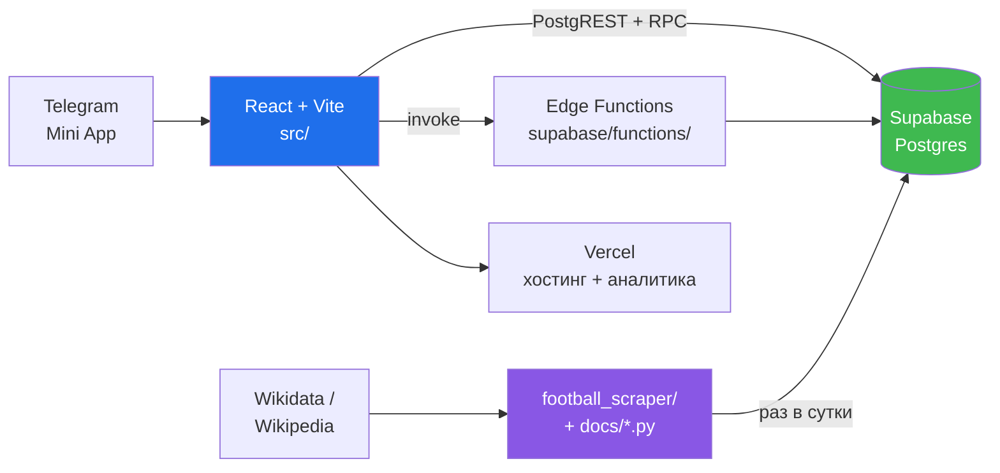
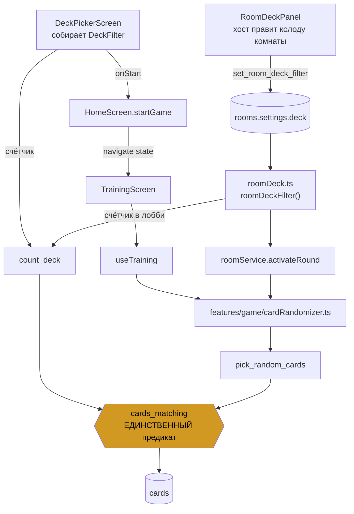
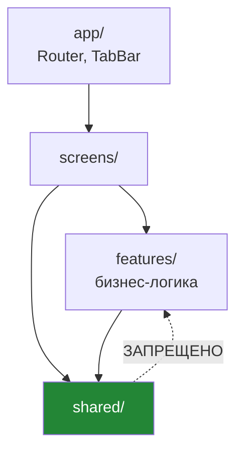
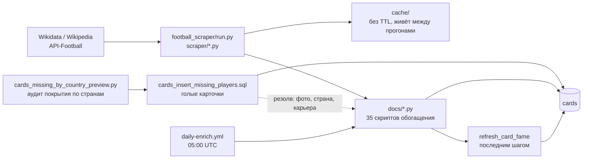

# Карта проекта

Справочник «что где лежит и как связано». `docs/ARCHITECTURE.md` рядом
говорит, **как должно быть** (правила FSD, запреты); этот файл — **как есть
сейчас**.

**Агенту:** прочитай отсюда нужный раздел вместо того, чтобы обходить дерево
grep'ом. Дальше — только те файлы, что названы. Если карта разошлась с кодом,
верен код: почини карту тем же PR.

---

## 1. Система целиком



Своего бэкенда нет. Клиент ходит в Supabase напрямую; всё, что нельзя
доверить клиенту, живёт в RPC с `SECURITY DEFINER` или в Edge Function.

---

## 2. Экраны и роуты

`src/app/Router.tsx` — единственное место, где заводятся роуты.

| Роут | Экран | Что делает |
|---|---|---|
| `/` | `HomeScreen` | **список игр**: Футбольный Элиас, ближайшие матчи, голы и заголовки, арена на двоих, фэнтези, «Угадай игрока». Над списком — `features/digest/HomeGoalPreview`: лучший гол выходных обложкой, потому что за словом «дайджест» его не находили. Действия самого Элиаса — режим и вход в комнату — на шаг внутрь (`view === 'alias'`) |
| `/lobby` | `LobbyScreen` | сбор команд, выбор колоды комнаты (`features/lobby/RoomDeckPanel.tsx`, правит только хост), старт игры, вход в голосовой канал |
| `/game` | `GameScreen` | сетевая игра по раундам; голосом управляют компактно, в шапке |
| `/end` | `EndScreen` | итоги, история карточек |
| `/training` | `TrainingScreen` | быстрая игра на одном телефоне |
| `/collection` | `CollectionScreen` → `collection/CardDossier` | коллекция и досье карточки (Pro) |
| `/profile` | `ProfileScreen` → `profile/WeeklyQuests` | уровень, XP, задания недели |
| `/friends` | `FriendsScreen` | рейтинг друзей по XP и кого добавить |
| `/fantasy` | `FantasyScreen` | фэнтези: состав из пяти, капитан, таблица лиг. **Два разных тура на экране** — заявка на ближайший открытый, таблица по текущему |
| `/digest` | `DigestScreen` | заголовки суток из открытых RSS-лент и видео с официальных каналов лиг. **Два разных порядка**: заголовки по «громкости» (сколько РАЗНЫХ изданий вышло с тем же сюжетом — просмотров RSS не отдаёт), ролики по времени (Atom-фид YouTube не отдаёт ни просмотров, ни лайков, и рейтинга там нет) |
| `/arena` | `ArenaScreen` | футбол на двоих **на одном телефоне**: canvas, физика 60 Гц, две площадки управления. Без `PageTransition` — обёртка анимирует transform родителя, и первые кадры уезжали бы вместе с ним. Игра на двух телефонах — соседним роутом, см. §4 |
| `/arena/online` | `ArenaOnlineScreen` | та же арена **на двух телефонах**: хост считает физику, гость шлёт ввод и рисует снимки с интерполяцией. Без `PageTransition` по той же причине, что и локальная. Подробности — §4 |
| `/ratings` | `RatingsScreen` | рейтинг футболистов за **неделю, месяц и год**. Очки — `гол*4 + пас*3`, та же шкала, что в фэнтези, и считает их Postgres, а не клиент. Под списком стоит дата сбора: пустая неделя — настоящий ответ во время паузы на сборные и она же вид мёртвого конвейера, а различить их можно только по ней. Годовое окно наполняется постепенно и честно говорит, с какого числа у него данные — см. §7а |
| `/matches` | `MatchesScreen` | матчи из `fixtures`, сгруппированы по дню **в часовом поясе зрителя**. Два режима: список ближайших (отсекает прошлое) и **календарь на месяц** (`MonthCalendar`, берёт месяц целиком со счетами сыгранных). Коэффициентов нет и быть не может: `fixture_odds` без гранта и без политики |
| `/pro` | `ProScreen` | покупка Pro за Telegram Stars |
| `/tutorial` | `TutorialScreen` | обучение |
| `/admin` | `AdminScreen` | кабинет: правка карточек, репорты (по паролю) |

`DeckPickerScreen`, `home/HomeGameLink` и `home/HomeAliasActions` — не роуты, а
части `HomeScreen`. `home/HomeLandingMaster` удалён: он был лендингом, когда
игра была одна.

**Приглашение в комнату — две половины одной фичи.** `features/lobby/invite.ts`
строит ссылку, `HomeScreen` читает её обратно
через `getStartParam()` (`shared/lib/telegram.ts` → `initDataUnsafe.start_param`)
и сразу пробует войти. Одна половина без другой бесполезна: ссылка откроет
приложение, но код не подставится. `start_param` — непроверенный ввод, поэтому
проходит через `normalizeCode()` до любого использования.

**Четвёртый путь — и он единственный без кода вообще.** `features/lobby/
InviteFriendsPanel.tsx` в лобби зовёт друга по имени (`invite_to_room`), а
`features/lobby/PendingInvitesPanel.tsx` на главной показывает приглашения
(`pending_room_invites`) — вход в один тап. Приглашение отдаёт **код**, и
дальше идёт тем же путём, что и набранный руками: `HomeScreen.joinByCode()` —
единственный вход в комнату, сколько бы способов до него ни вело.

Само поле кода нормализуется `sanitizeCodeInput()` (`invite.ts`): в состоянии
лежит ровно то, что может быть кодом, поэтому управляемое значение не спорит с
тем, что только что выдала клавиатура. Оно же вынимает код из вставленной
ссылки. Полный код запускает вход сам — шестой символ и есть кнопка.

Третий путь — QR на ту же ссылку: `shared/lib/qr.ts` (свой кодировщик, без
зависимости в бандле) и `shared/ui/QrCode.tsx`. Правится он только вместе с
`qr.test.ts`, который читает нарисованное настоящим декодером: ошибка в битах
даёт код, который выглядит безупречно и не сканируется.

---

## 3. Путь колоды — главный инвариант

Число под кнопкой и розданные карточки обязаны совпадать. Поэтому фильтр
**один объект**, а предикат **один SQL**:



* Тип фильтра — `src/shared/types/deck.ts` (`DeckFilter`).
* SQL — `supabase/migrations/deck_rpc.sql`.
* У комнаты фильтр тоже **один**, в `settings.deck`, и читают его **только**
  через `roomDeckFilter()` (`src/features/room/roomDeck.ts`): она же
  подставляет `settings.categories` комнатам, созданным до появления `deck`.
  Пишет его только `set_room_deck_filter` — и заодно зеркалит `categories`,
  потому что раздать раунд может любой клиент в комнате, включая сборку,
  которая про `deck` не знает.
* `pick_random_cards` и `count_deck` — **единственные** обёртки над
  `cards_matching`. Новый способ выбирать карточки заводить нельзя: он
  разойдётся со счётчиком.
* Предыстория — `docs/FILTERS_REWORK.md`.

⚠️ В `deck_rpc.sql` лежит **легаси-версия `pick_random_cards` на 12
позиционных параметров**. Это временный шим: прод зовёт её позиционно, и её
удаление один раз уже уронило живое приложение. `DROP` выписан в том же
файле — выполнить только после того, как новый фронт раскатан везде.

---

## 4. Слои и зависимости



**`shared/` не импортирует из `features/` и `screens/`** — никогда. Это
правило из `docs/ARCHITECTURE.md`, и его нарушение ломает переиспользование.

| Слой | Путь | Что там |
|---|---|---|
| Состояние | `shared/store/` | `authStore`, `gameStore`, `proStore`, `settingsStore` (Zustand) |
| Типы | `shared/types/` | `database.ts` (зеркало схемы), `deck.ts` (фильтр), `game.ts` |
| Чистая логика | `shared/lib/` | `level`, `quests`, `tier`, `pro`, `photoFit`, `cardName`, `flag`, `sounds`, `telegram`, `useMainButton`, `useKeyboardOpen`, `qr`, `supabase` |
| Компоненты | `shared/ui/` | `Button`, `Chip`, `OptionRow`, `PlayerCard`, `Avatar`, `Timer`, … |
| Фичи | `features/<имя>/` | `use<Фича>.ts` + `<фича>Api.ts` |

Фичи: `auth`, `room`, `lobby`, `game`, `collection`, `pro`, `quests`,
`reports`, `admin`, `voice`, `friends`, `digest`, `arena`.

### Арена: три отдельные вещи, а не одна

`features/arena/` разделена не по вкусу, а по тому, что в ней можно проверить.

| Файл | Отвечает за | Почему отдельно |
|---|---|---|
| `physics.ts` | правила: столкновения, стены, гол | чистая функция «состояние + ввод + dt → состояние». Без canvas и без времени, поэтому её свойства проверяются тестом, а не глазами |
| `useArena.ts` | ход времени: цикл, счёт, пауза после гола, победа | шаг фиксирован (1/60), кадр только НАКАПЛИВАЕТ время; потолок кадра — свойство цикла, а не физики |
| `render.ts` | как это выглядит | палитра приходит из CSS-переменных, а не из hex в компоненте; холст шире поля на глубину сеток |
| `ArenaPad.tsx` | касания | pointer events с `setPointerCapture` и разбором по `pointerId`: пальцев на экране до четырёх сразу |

**Сетевая арена есть — но не та, которой тут не будет.** Прежняя запись
отвергала СИНХРОННУЮ физику: два телефона считают один шаг и ждут друг друга,
что требует обмена 60 раз в секунду при задержке в единицы миллисекунд, а
замер этого проекта — 150–300 мс между континентами
(`docs/VIDEOCHAT_HANDOFF.md`). Этот довод в силе и сегодня, и синхронной арены
по-прежнему не будет.

`/arena/online` устроен иначе и задержку терпит:

| Файл | Отвечает за |
|---|---|
| `net.ts` | протокол: снимок, ввод, буфер с интерполяцией, стягивание предсказания. Чистый — потому и проверен тестами без сети |
| `useArenaNet.ts` | канал Supabase Realtime **broadcast** (не `postgres_changes`, как в лобби: двадцать посылок в секунду, каждая протухает через 50 мс) + presence |
| `arenaSession.ts` | комната, пережившая перезапуск приложения. Код и роль в `localStorage` на четверть часа, проверяются при чтении теми же правилами, что и ввод с экрана. Возвращает **комнату, а не счёт** — физика живёт в памяти хоста |
| `useArenaGuest.ts` | цикл гостя: физику НЕ считает |
| `screens/ArenaOnlineScreen.tsx` | код комнаты, ожидание, игра. Отдельный роут, чтобы не заводить четыре новых состояния внутри чужого экрана |

Шаг считает только хост; гость шлёт ввод, рисует присланное с задержкой в
`INTERP_DELAY_MS` и предсказывает **одну лишь свою ракетку**, подтягивая её к
авторитетной позиции. Локальная арена на одном телефоне остаётся и не
тронута — премиса «один телефон, две команды» никуда не делась.

---

## 5. Фаза игры — только через машину состояний

`features/game/stateMachine.ts` — единственный способ менять фазу. Прямое
присваивание запрещено.

Зовут `transition()`: `features/room/useRoom.ts`,
`features/lobby/useLobby.ts`, `features/game/useGame.ts`.

---

## 6. Серверная поверхность

**RPC** (`supabase/migrations/`):

| Функция | Файл | Назначение |
|---|---|---|
| `cards_matching`, `pick_random_cards`, `count_deck` | `deck_rpc.sql` | колода |
| `fame_tier`, `refresh_card_fame` | `deck_fame.sql` | известность (перцентиль) и производные |
| `collection_views`, `collection_page` | `collection_page_by_lang.sql` | коллекция: страница каталога в порядке языка зрителя. **Не путь колоды** — карточку не раздаёт |
| `increment_player_stats` | `player_progression_xp.sql`, `weekly_quests.sql` | статистика + XP + прогресс заданий, `SECURITY DEFINER` |
| `get_weekly_quests`, `claim_weekly_task`, `weekly_task_codes`, `current_week_start` | `weekly_quests.sql` | задания недели |
| `get_user_status`, `tg_is_pro` | `pro_users.sql`, `pro_onboarding.sql` | Pro и проверка `initData` по HMAC |
| `create_team_room` | `create_team_room.sql` | создание комнаты |
| `set_room_deck_filter` | `room_deck_filter.sql` | хост выбирает колоду комнаты; пишет `settings.deck` и зеркалит `settings.categories`. Только хост, только пока `waiting` — `rooms` пишут все, политика `USING (true)` |
| `predict_match`, `my_predictions`, `prediction_points`, `settle_predictions`, `sports_awaiting_scores`, `upsert_fixture_scores` | `match_predictions.sql` | прогноз счёта игроком. **Не букмекерский** — коэффициенты вне экрана по §4 `LIVE_FOOTBALL_HANDOFF.md`. Приём закрывается по `now()` на сервере. Начисляют и пишут счёт только `service_role` |
| `my_prediction_history` | `prediction_history.sql` | история прогнозов с именами команд и настоящим счётом — `my_predictions` их не даёт, `fixtures` не хранит переводов. Join на сервере, а не два запроса с клиента: `fixture_id` — внешний ключ на `fixtures.id`, разойтись с источником нечем |
| `invite_to_room`, `pending_room_invites`, `decline_room_invite`, `room_invite_ttl` | `room_invites.sql` | позвать друга в комнату без кода. Обе стороны выводятся из подписанного `initData`: приглашение называет двоих, и клиенту нельзя дать назваться любым из них. Срок жизни выводится из статуса комнаты, а не из cron |
| `pause_round`, `resume_round`, `max_round_pause_ms` | `pause_round_on_voice_drop.sql` | пауза таймера, пока у объясняющего нет голоса; потолок — 2 минуты |
| `digest_weekend_goals`, `weekend_bounds`, `looks_like_goal` | `weekend_goals.sql` | голы последних **завершившихся** выходных; порядок — сначала голы, внутри по настоящим просмотрам из фида YouTube. ⚠️ «Гол» включает ОБЗОР МАТЧА (`highlights`, `resumen`, `resumo`): голы выходных лежат именно там, и без этого раздел показывал 9 роликов по 21 тыс. просмотров вместо 56 по 69 тыс. |
| `digest_news`, `digest_goals`, `digest_tokens`, `digest_translit`, `prune_digest` | `football_digest.sql` | дайджест дня; громкость считается ПРИ ЧТЕНИИ, потому что сюжет набирает её постепенно. `digest_translit` сводит кириллицу и латиницу к одной записи — без неё русская половина лент не имела с остальными **ни одного** общего ребра |
| `digest_topics` | `digest_topics.sql` | горячие **темы**, а не заголовки: заметки — вершины, ребро при трёх общих основах, тема — заметка-ядро с её прямыми соседями. **Не связная компонента**: та транзитивна, и A—B—C сводила в одну тему сюжеты без единого общего слова. Работает и через языки на латинице, и через алфавиты — благодаря `digest_translit`. Горячесть — число **изданий**, а не заметок |
| `digest_topics_key`, таблица `digest_summary` | `digest_summary.sql` | пересказ тем языковой моделью, по одному на язык. Ключ кэша — отпечаток **набора тем**, поэтому нажатия кнопки не умножают расход: платим за новость, а не за нажатие. Читает и пишет только `service_role` — иначе клиент показал бы вчерашнюю сводку под сегодняшними темами |
| таблица `digest_source` | `digest_sources.sql` | откуда дайджест берёт ленты, каналы и лиги ESPN. Меняется `INSERT`'ом и `enabled`, без деплоя. Читает только конвейер: RLS включён, политик нет, грантов сверх `service_role` нет |
| `fetch_football_digest` | `schedule_football_digest.sql` | pg_cron **каждые 10 минут** → Edge `football-digest`. Квота YouTube: 18 единиц за прогон (9 каналов × 2 запроса), 2592 в сутки из 10 000 |
| таблица `live_streams`, `digest_live_matches`, `looks_like_match`, `is_studio_talk` | `live_streams.sql` | что из футбола идёт ПРЯМО СЕЙЧАС на официальных каналах лиг. Признак «это матч» **не хранится**, а считается при чтении — как `looks_like_goal`, и по той же причине. Отрицание сильнее утверждения: «RC DEPORTIVO vs ELCHE CF \| RUEDA DE PRENSA» — не матч |
| `fetch_live_streams` | `schedule_live_streams.sql` | pg_cron каждые 10 минут → Edge `live-streams`. Десять минут против часового окна чтения: эфир успевает подтвердиться шесть раз |
| `claim_room_voice_provider`, `move_room_voice_provider` | `room_voice_provider.sql` | голосовой сервис комнаты: захват и перевод всей комнаты на живой |
| `deck_squads`, `rebuild_card_current_clubs`, `club_match_key` | `current_squads.sql` | актуальные составы клубов для фильтра `clubs`. Пересобирается `pg_cron` в 06:10 UTC — `schedule_squad_rebuild.sql` |
| `spend_odds_credits`, `odds_credits_left`, `upsert_fixtures`, `club_card_by_name` | `fixtures_and_odds.sql` | расписание матчей и бюджет the-odds-api (500 кредитов в месяц) |
| `fetch_fixtures_list` | `schedule_fetch_fixtures.sql` | pg_cron раз в 6 часов (`:35`) → Edge `football-fixtures` без действия — заводит НОВЫЕ матчи. ⚠️ До 23.08.2026 этого задания не было вовсе: только счета обновлялись по расписанию (`fetch_match_scores`), а расписание турниров — только вручную. РПЛ из-за этого держала ноль строк при верной настройке |
| `fetch_match_scores` | `schedule_fetch_scores.sql` | pg_cron каждые 6 часов (`:05`) → Edge `football-fixtures` с `{"action":"scores"}` — обновляет счета у УЖЕ существующих матчей, новых не заводит |
| `fixtures_horizon` | `fixtures_horizon.sql` | докуда расписание известно. `published_until` — последний день ПЕРЕД разрывом длиннее недели, а не `max(commence_at)`: один далёкий матч не делает известным месяц вокруг себя. Этим красится календарь, и только благодаря этому пустая клетка не заявляет «матчей не будет» |
| `end_round` | `end_round_rpc.sql` | захват раунда, подсчёт и запись очков — **одной транзакцией** |
| `award_room_stats`, `on_room_finished` | `award_stats_on_finish.sql` | начисление статистики при переходе комнаты в `finished` |
| `sweep_stale_rooms` | `sweep_stale_rooms.sql` | серверная развёртка брошенных игр, `pg_cron` каждые 5 минут |
| `record_room_encounters`, `friends_with_rating`, `friend_suggestions`, `add_friend`, `remove_friend` | `friends_and_rating.sql` | кто с кем играл, рейтинг друзей и рекомендации |
| `player_ratings`, `player_stats_freshness` | `player_match_stats.sql` | рейтинг футболистов по окну в днях и свежесть собранного. Свежесть — отдельной функцией намеренно: без неё «за неделю никто не забил» звучит одинаково при паузе на сборные и при сломанном сборе |
| таблица `broadcasts` | `broadcasts.sql` | «где смотреть» — официальная страница ТУРНИРА по `sport_key`. Не список стримов и не «канал в вашей стране»: адреса перепроверяются по `checked_at`, а не по памяти |
| таблица `broadcast_rights`, `broadcast_rights_for` | `broadcast_rights.sql` | вещатели по территориям **со сроком от самого источника** (`season_from`/`season_to`) — этим и отличается от того, что `broadcasts` вести отказалась. Территория текстом дословно (`Sub-Saharan Africa`, `Ships and planes` — не страны), код страны отдельной колонкой и только для однозначных. **Оба аргумента функции необязательны** — один путь чтения на оба вопроса («моя страна, все турниры» и «этот турнир, все страны»). Флаг `worldwide` — отдельная категория прав, а не «регион без кода»: MLS продана Apple одним пакетом на весь мир, и такая строка подходит любой стране, но идёт ПОСЛЕ местной. Читают `broadcastRightsApi.ts` → `FixtureCard`. ⚠️ Пустой ответ значит «не заявлен», а не «неизвестно». Данные пока по двум турнирам: АПЛ (84 территории) и MLS (мировые) |
| `player_news`, `player_clips`, `player_surname_stem` | `player_news_and_clips.sql` | новости и видео ПРО ИГРОКА на досье — связка с дайджестом по фамилии через `digest_tokens`, ту же токенизацию, что клеит темы через алфавиты. ⚠️ Однофамильцы — известный предел, не баг: «Silva» носят десятки профессионалов |

⚠️ **`grant_pro` в репозитории нет.** `tg-pay` зовёт её по предполагаемой
сигнатуре `grant_pro(p_secret text, p_telegram_id bigint)`, а определение
живёт только в проде. Меняешь оплату — сначала посмотри функцию в базе, в
файлах её не найдёшь.

**Edge Functions** (`supabase/functions/`):

* `tg-pay` — оплата Telegram Stars; проверяет `initData` на сервере.
* `livekit-token` — токен голосового канала; канал **и сервис** выбирает
  сервер (`VOICE_PROVIDER`: livekit / daily / agora). Имя историческое —
  `docs/VOICE_PROVIDERS.md`. Грант LiveKit разрешает **микрофон и камеру**;
  демонстрация экрана не разрешена и не будет — на экране объясняющего
  открыта карточка.
* `football-digest` — RSS/Atom и JSON ESPN → `news_items`, `goal_clips`. Состав
  источников определён проверкой, а не репутацией (Reddit и Scorebat отвечают
  403 всем, кто не платит). Ключ нужен ровно один и только на ролики
  (`YOUTUBE_API_KEY`): без него работают пять прежних каналов по Atom, с ним —
  девять через официальный API. Ленты и новости ESPN ключей не требуют. Не
  ранжирует — только приносит.

* `live-streams` — идущие эфиры с ОФИЦИАЛЬНЫХ каналов лиг (список каналов —
  та же таблица `digest_source`). Не агрегатор стримов: источник — канал
  самого правообладателя.

  ⚠️ **Официальный API здесь не годится, хотя ключ есть**, и это замер, а не
  предпочтение. Идущий эфир **не лежит в списке загрузок канала** — проверено
  на живом эфире MLS: сто роликов в `UUSZbXT5TLLW_i-5W8FZpFsg`, эфира среди
  них нет. Значит дешёвая пара `playlistItems` + `videos.list` (2 единицы) его
  не найдёт, а `search.list` с `eventType=live` стоит **100 единиц за канал**:
  девять каналов раз в час — 21 600 в сутки при квоте 10 000. Поэтому берётся
  публичная страница `youtube.com/channel/<id>/live` (ноль квоты; `robots.txt`
  YouTube запрещает `/feeds/videos.xml`, `/results`, `/youtubei/`, но не
  `/channel/` и не `/live`), а заголовок — через публичный oEmbed без ключа.

  Цена решения — разметка: мы читаем страницу, и YouTube вправе её поменять.
  Отказ поэтому тихий и безопасный — не нашли, не записали. Различить «футбола
  нет» и «сломался разбор» можно по полю `parsed` в ответе функции: ноль при
  девяти каналах — второе.

  **Список каналов раздельный: `kind='channel'` и `kind='live'`.** Дайджест
  читает только первый и качает оттуда голы официальным API (2 единицы квоты
  на канал за прогон); `live-streams` читает оба и ходит на публичную страницу
  без ключа. Канал, который ведёт живые матчи, но голов в ленту не даёт,
  заводится как `live` — и не расширяет ни ленту, ни расход квоты.

  Заведены обходом 18.08.2026: **Concacaf** (30/30 матчей), **A-Leagues**
  (30/30), **AFC Asian Cup** (19/30). Отвергнуты и почему — в шапке
  `digest_sources.sql`; коротко: Indian Super League ведёт **киберфутбол**
  (eISL — настоящие клубы, видеоигра), Ekstraklasa — **сопроводительные
  стримы** («LIVE IRL», сам матч на Canal+Sport 3), J.League — только обзоры,
  а `@theafc` вообще **чужой канал** с тем же именем.

  **Что каждый канал на самом деле транслирует** — обход вкладок
  `/channel/<id>/streams`, 308 заголовков, 17.08.2026. Это отвечает на вопрос
  «почему раздел пуст» лучше любого рассуждения:

  | Канал | Трансляций | Из них матчей | Что именно |
  |---|---|---|---|
  | MLS | 30 | **30** | MLS NEXT PRO целиком |
  | CONMEBOL | 30 | **27** | молодёжные сборные, футзал |
  | Liga MX | 26 | **23** | юношеские турниры, «Partido Completo» |
  | Premier League | 30 | **12** | NEXTGEN Cup |
  | Bundesliga | 3 | **2** | предсезонные товарищеские |
  | UEFA | 30 | 2 | финалы женского Кубка Европы |
  | Serie A | 29 | 1 | Primavera U19 |
  | K League | 72 | 0 | только 30-минутные обзоры |
  | LALIGA | 30 | 0 | только пресс-конференции и превью |
  | Ligue 1 | 28 | 0 | только повторы и разборы |

  Три нуля внизу — правильный ответ, а не поломка: эти каналы живых матчей не
  открывают вовсе. Добавлять их в список не вредно (предикат их отсеет), но и
  не полезно.

  **Каналы только для эфиров** заводятся с `kind = 'live'`: football-digest
  фильтрует `kind = 'channel'`, поэтому лента голов ими не расширяется и квота
  YouTube API не тратится. Обход 18.08.2026 добавил три — Concacaf 30/30,
  A-Leagues 30/30, AFC Asian Cup 19/30 — и отверг три:

  | Кандидат | Что оказалось |
  |---|---|
  | `@theafc` | 12 трансляций, 0 матчей — **вообще не Азиатская конфедерация**: «AFC GB Rehearsal vid», «Revolution Praise @ Momentum 2011». Тёзка по аббревиатуре |
  | `@IndianSuperLeague` | 29 из 30 — `eISL`, то есть **киберфутбол**: настоящие клубы, настоящее «vs», играют в видеоигру |
  | `@Ekstraklasa` | 29 трансляций, все `LIVE IRL`, и в тех же заголовках «Mecz w Canal+Sport 3» — матч идёт на платном ТВ, а на YouTube его комментируют |

  Первые два случая добавили исключений в `is_studio_talk`: предикат их не
  ловил. Сразу после — 12 каналов вместо 9 и два матча на экране вместо одного.

  ⚠️ **Списка источников в исходнике функции нет.** Он в таблице
  `digest_source` (`digest_sources.sql`), и менять его надо там: добавить
  ленту — `INSERT`, снять — `enabled = false` с причиной в `note`. Деплой для
  этого не нужен, и это не удобство, а устранение риска: пока список жил в
  коде, цена добавления одной ленты равнялась переносу шестисот строк
  агентом — а такой перенос однажды уже вписал в прод `ᑑ` вместо `ё`.
  Снятые источники из таблицы **не удаляются**: причина снятия измерена и по
  имени источника не выводится, а без неё следующий добросовестно вернёт
  `@EFL` обратно.
* `digest-summary` — связный пересказ горячих тем языковой моделью, **по
  кнопке**. Единственная часть приложения, которую игрок может заставить
  потратить деньги, и ограничена она не лимитом, а ключом кэша: им служит
  отпечаток набора тем (`digest_topics_key`), так что любое число нажатий на
  одних и тех же новостях отвечает одной записью. Верхнюю границу расхода
  задают новости, а не игрок.

  ⚠️ **Заголовки лент — чужой текст**, их пишет кто угодно. Поэтому они уходят
  в модель как данные внутри блока `<headlines>`, а системная подсказка
  отдельно говорит, что внутри блока — материал для пересказа, а не команды.

  ⚠️ **Модель отказывается отвечать на безобидном футболе, и часто.** Замер на
  одном наборе тем: Opus 5 сам ответил на en/es/fr/ru/zh и **отказался на
  ar/ja/ko/pt** — четыре локали из девяти. Подсказкой это не лечится (тот же
  запрос со второй попытки проходит), поэтому запрос идёт с
  `fallbacks: "default"`, и на отказ отвечает запасная модель. Какая именно —
  видно в колонке `digest_summary.model`; без неё вопрос «почему сводки вдруг
  стали другими» остался бы без ответа.
* `assistant-bot` — личный ассистент владельца в отдельном боте. К игре
  отношения не имеет и **секретов с ней не делит**: читает
  `ASSISTANT_BOT_TOKEN`, тогда как `tg-pay` читает `TELEGRAM_BOT_TOKEN`, а
  `tg_validate_init_data` — запись Vault `telegram_bot_token`. Секрет вебхука
  не заводится вручную: это `sha256(ASSISTANT_BOT_TOKEN)`, поэтому установка и
  проверка не могут разойтись — но ротация токена требует повторного
  `{"action":"install"}`. Владелец фиксируется по первому написавшему
  (`assistant_owner`), остальные игнорируются молча. Две модели, выбор живёт в
  `assistant_owner.model` и переключается командой `/model`: Claude Opus 5 для
  разбора, Gemini Flash — дешёвый, и дешёвым его делает `thinkingBudget: 0`, а
  не имя. **Читает этот репозиторий** инструментами `list_files` / `read_file`
  — без единого секрета, потому что репозиторий публичный. Список файлов
  кэшируется на час (`assistant_repo_tree`), содержимое — никогда. Ещё два
  инструмента: `query_db` (PostgREST **ключом anon**, то есть ровно то, что
  видит игрок — свою же переписку бот через него не прочитает) и `ci_status`
  (прогоны Actions). Изменить он не может ничего. `/repo` показывает, что
  видно, `/usage` — сколько токенов ушло.

**RLS**: `supabase/migrations/rls_lockdown.sql` — образец для новых таблиц.
Игрок читает свой прогресс, но **не пишет** его; запись — только через
`SECURITY DEFINER`.

---

**Что дальше по футбольной части** — `docs/FANTASY_AND_MINIGAMES.md`: почему
фэнтези строится на клубах, а не на статистике игроков (её нет и бесплатно не
будет), какие 790 карточек реально привязаны к ближайшим матчам, и какие
мини-игры не требуют ни одного нового источника.

---

## 7. Конвейер данных



`fame` — **перцентиль**, поэтому его пересчитывают после последнего шага,
меняющего `pageviews` или `pageviews_i18n`. Иначе шкала съезжает, а вместе с
ней `tier` и тег `legend`.

⚠️ Считается он **не от `cards.pageviews`**: та колонка — только ру-вики.
Метрика — `GREATEST(pageviews_ru, max по 8 языкам из pageviews_i18n)`
(`deck_fame.sql`). Ранговая корреляция ru-only с этой осью — 0.172, то есть
это разные величины; замер в `docs/PLAYER_ATTENTION_ANALYSIS.md`.

## 7а. Статистика футболистов — второй конвейер, отдельный от карточек

`player_match_stats` наполняют **два независимых сборщика**, оба каждое утро в
04:40 UTC (`.github/workflows/player-stats.yml`), и разбор у обоих вынесен в
чистые модули с тестами без сети:

| Сборщик | Разбор | Тесты | Что берёт |
|---|---|---|---|
| `sports_ru_stats.py` | `scraper/sports_ru.py` | `tests/test_sports_ru.py` | матчи игрока, **с минутами** |
| `espn_stats.py` | `scraper/espn.py` | `tests/test_espn.py` | матчи лиги, **без минут** |

Шаги в workflow разделены и второй стоит с `if: always()`: источники
независимы, и падение одного не должно уносить второй.

⚠️ **ОДИН МАТЧ ЛЕЖИТ В ТАБЛИЦЕ ДВУМЯ СТРОКАМИ.** Первичный ключ —
`(card_id, match_date, tournament)`, а `tournament` пишется словарём
источника: sports.ru печатает «США. МЛС», ESPN — «MLS»
(`header.league.name`). Строки не конфликтуют, и обе остаются.

Так и задумано: две независимые записи одного матча — единственное, чем
ловится тихая поломка разбора (сдвиг колонок на sports.ru однажды выдал 62
гола вместо 59, и оба числа выглядели правдоподобно). Но **считать по этой
таблице напрямую нельзя**: `sum(goals)` по двум строкам даёт удвоенный гол,
`count(*)` — «2 матча» за один сыгранный. `player_ratings` и
`player_collected_totals` поэтому сначала сворачивают строки к одной на
игрока-и-день (`distinct on`), и выигрывает та, что **знает больше**: минуты
есть у sports.ru и отсутствуют у ESPN. Новый читатель обязан делать то же.

Замерено на боевых данных до первого прогона ESPN: без свёртки Мбаппе выходил
с 60 очками вместо 30 и 10 матчами вместо 5 — ровно вдвое по каждому игроку.

ЗАЧЕМ ВТОРОЙ. sports.ru находит игрока только через слаг, а слаг есть не у
всех (см. ниже). ESPN ключуется по лиге и матчу, а не по игроку, поэтому
достаёт тех же людей с другой стороны — и тоже без ключа.

**Зачем понадобилась новая таблица.** Похожие в схеме есть, и это ловушка:
`player_stats` — про игроков ПРИЛОЖЕНИЯ (`games_played`, `xp`),
`player_seasons` — про просмотры, `player_career` пуст, и его зерно всё равно
сезон. Сезонная сводка не отвечает на вопрос «кто забил за семь дней»: окно
требует зерна в один матч.

**Цепочка, каждое звено проверено `urllib.robotparser`:**

```
/football/club/<seed>/table/  -> слаги остальных клубов лиги
/football/club/<slug>/team/   -> (слаг игрока, русское имя)
/football/person/<slug>/stat/ -> строка на матч, С ДАТОЙ
```

⚠️ `Disallow: /stat/` в robots.txt — правило по ПРЕФИКСУ: оно закрывает
`sports.ru/stat/…`, но не `/football/person/<slug>/stat/`. Закрыты `/api/`,
`/ajax/` и `/search/` — поэтому слаги обходятся, а не ищутся.

⚠️ **Слаг нельзя вывести из имени.** «Нино» у «Зенита» живёт по адресу
`marcilio-florencia-mota-filho`, «Джон Джон» — `jhonatan-dos-santos-rosa`:
это полные имена за односложным игровым. Отсюда таблица `sports_ru_player`.

⚠️ **Составы отдаются в HTML только у российских клубов** — у Челси блок
`b-tag-team-squad__content` буквально пуст, `/football/sportsman/` тоже
рендерится на клиенте. Для остальных слаг ПРЕДПОЛАГАЕТСЯ по латинскому имени
и **проверяется** по шапке страницы: она печатает **оба** написания, русское и
латинское, и достаточно совпадения по любому из них — иначе верная страница
отвергалась на расхождении транслитерации, а не игрока («Уго» против «Юго»:
0.70 по-русски, 1.00 по-латыни). Порог при этом не снижен: он и есть защита от
чужого игрока.

Формы слага, которые перебираются: полное имя, хвост после первого слова,
голая фамилия и **голое имя** — у бразильцев играющее имя это имя, «Vinícius
Júnior» живёт на `/football/person/vinicius/`.

⚠️ **Диакритика сворачивается ВЫВОДОМ (NFKD), а не списком.** Рукописная
таблица на 31 символ молча ела буквы, которых в ней нет: `translate` их не
трогал, а `re.split(r"[^a-z0-9]+")` выбрасывал, и «Modrić» давал `luka-modri`
— слаг, которого не существует. Замер дыры: 52 карточки из 513, каждая
десятая. Осталась маленькая таблица только для букв, у которых штрих часть
самой буквы (ø, đ, ł, ı, ß, þ, ð, æ, œ) — этот список конечен.

⚠️ **Дыра не закрыта до конца, и остаток не выводится из карточки.** Сайт
иногда пишет имя иначе, чем колода: Фоден живёт на `philip-foden` (карточка
знает «Phil»), Родри — на `rodri-hernandez`. Замер на 16 карточках после
правок: 11 разрешено против 4 до них. Холанна не нашлось ни одной из
перебранных форм — его слаг придётся однажды взять со страницы клуба или
завести руками.

⚠️ **Годовое окно наполняется постепенно.** Страница отдаёт ОДИН сезон,
переключатель сезонов ходит в `/ajax/`, а `?season=` игнорируется (проверено).
Поэтому первый сбор дотягивается только до начала текущего сезона, и
`player_stats_freshness().first_match` существует ровно затем, чтобы экран
назвал настоящую дату вместо обещания года.

### Источники статистики: что проверено и что отвергнуто

Замерено запросом 16.08.2026, а не взято по репутации.

| Источник | Ключ | Ответ | Зерно |
|---|---|---|---|
| sports.ru `/football/person/*/stat/` | нет | 200 | **матч + дата** — подключён |
| ESPN `site.api.espn.com` | нет | 200 — но **только с полным User-Agent**: на голый `SherlockScholesBot/1.0` Akamai отвечает 403 | **матч + дата**, но **без минут** — подключён |
| api.openligadb.de | нет | 200 | **события голов** (`getmatchdata`): бомбардир, минута, пенальти/автогол, с датой. Ассистов нет. Только немецкие лиги, и каталог краудсорсный — 820 записей, в основном любительские, лигу вслепую брать нельзя |
| api.football-data.org | бесплатный | 403 без ключа | сезонные бомбардиры |
| TheSportsDB | тестовый | 200 | таблицы, статистики игроков нет |
| openfootball (GitHub) | нет | 200 | только матчи и счёт |
| **whoscored.com** | — | **403** | robots открывает `/statistics`, сервер бота не пускает |
| fbref.com | — | Cloudflare-челлендж | — |
| understat.com | — | `Disallow: /` | — |
| api.sofascore.com | — | **403** | — |
| Flashscore | — | ToS запрещает переиспользование | — |
| **news.google.com/rss** | — | robots: `User-agent: * → Disallow: /`, отдельной строкой названы `ClaudeBot` и `anthropic-ai` | содержимое отличное (102 свежие заметки с атрибуцией), но путь закрыт |
| api.gdeltproject.org | нет | **429** с этого адреса, проверить не удалось | — |
| public.api.bsky.app | — | **403** | — |
| api.dailymotion.com | нет | 200 | ролики есть, но поиск отдаёт мусор: 2008 год, два просмотра |
| reddit.com/r/soccer | — | **403** | подтверждает прежний замер |

⚠️ **Поправка к первому замеру openligadb.** Сначала он был отвергнут как
«сезонные итоги» — потому что смотрели `getgoalgetters`. Это была ошибка
метода: у того же API есть `getmatchdata`, и он отдаёт события голов с датой.
Вывод «источник не годится» был сделан по одной ручке из нескольких.

Подключены только двое, и это не лень: **окно в 7 дней требует зерна в один
матч**. Сезонный итог бомбардиров к недельному рейтингу не приводится никак,
сколько бы источников с ним ни собрать.

⚠️ У ESPN **нет минут**: `subbedIn`/`subbedOut` булевы. Пишется `NULL`, а не
ноль — рейтинг ломает ничью по «меньше минут при той же отдаче», и выдуманный
ноль выигрывал бы её у тех, кто её заслужил.

⚠️ В ответе ESPN лежат коэффициенты (`odds`, `pickcenter`). Разбор их не
читает и не должен: коэффициенты в этом проекте только внутренние.

### Языковые просмотры: два резолва, а не один

`docs/cards_pageviews_i18n.py` наполняет `pageviews_i18n` и делает это
**по-разному для игроков и всех остальных**:

* **игрок** — батчами по 50 через ру-вики `action=query`: голое имя карточки
  и есть титул статьи, с точностью до нормализации и редиректа;
* **всё остальное** — через резолвер конвейера (`run.resolve_card_qid`), тот
  же, что у фото и описаний: сначала «<имя> (футбольный клуб)» / «(стадион)»,
  потом голое имя, потом полнотекстовый поиск, и на каждом шаге **P31-гард**.

⚠️ Голое название неигровой карточки — это обычно **не она**. «Зенит» в
ру-вики — астрономический зенит (Q82806), «Факел» — факел, «Брест» — город.
Отсюда `name_en = "Zenith"` и `"Torch"` в проде: их проставил резолв по
голому имени. Гард отбраковывает такое, и карточка остаётся **без** данных —
это правильный исход: пустой `pageviews_i18n` оставляет её на русском
порядке, а чужая слава испортила бы и сортировку, и рамку редкости.

Порядок сортировки коллекции — `collection_views()` (§6), и запасной путь
там **`COALESCE`, а не `GREATEST`**: максимум всегда возвращал бы русский
счёт, и француз по-прежнему открывал бы «Клубы» на «Зените».

⚠️ Кэш скрапера **не имеет TTL и переезжает между прогонами CI**. Один
записанный промах «ничего не найдено» глушил бы запрос вечно — поэтому
промахи не кешируются, а `docs/cache_prune_empty.py` чистит накопленные.
Симптом поломки: «115 карточек обработано, бюджет 0/20000».

---

## 8. Проверки

```bash
npx tsc --noEmit          # noUnusedLocals включён
npm test                  # vitest
npm run test:mutation     # stryker, порог 80 — понижать нельзя
node scripts/check-i18n.mjs
npm run build
cd football_scraper && python3 -m pytest -q          # только hypothesis-тест
cd football_scraper && for f in tests/test_*.py; do python3 "$f"; done

# Серверная логика — руками, базы в CI нет:
psql "$DATABASE_URL" -f supabase/tests/sweep_stale_rooms.test.sql
psql "$DATABASE_URL" -f supabase/tests/collection_page.test.sql
psql "$DATABASE_URL" -f supabase/tests/player_ratings_dedup.test.sql
```

`supabase/tests/*.test.sql` — фикстуры и проверки внутри одной транзакции с
`ROLLBACK`. Гонять **не на проде**: развёртка обходит все комнаты, а тест
вызывает её и с нулевым запасом. Локальная копия или ветка Supabase.

Тесты фронта: `src/**/*.test.ts`, плюс `test/data-integrity/cards.test.ts`
поверх `sherlock_cards.csv`.

Тесты скрапера — **самостоятельные скрипты**, pytest собирает из них только
`test_property_canonical.py`. CI (`ci.yml`) прогоняет и то, и другое.

⚠️ GitHub Actions в этом репозитории **регулярно теряет событие
`pull_request`**. Пуш может остаться вообще без проверок — и это выглядит как
«ещё идут», а не как провал. После пуша смотри чеки PR; если там только
Vercel — запусти `ci.yml` через `workflow_dispatch`.

---

## 8а. Итог аудита «поверхностных» мест — и три поправки к нему

Аудит делался грепом, и **два из шести его выводов оказались неверны именно
из-за признака, по которому мерили**. Записано здесь, чтобы никто не пошёл
чинить то, что чинить не нужно.

| Вывод аудита | Что оказалось на деле |
|---|---|
| «30 мест глотают ошибку» | Завышено. В счёт попали ЗАПИСИ, возвращающие `false` при отказе, — это не болезнь: вызывающий видит отказ и говорит игроку. Опасна только форма ЧТЕНИЯ, возвращающая пустой список; таких было **шесть**, и все перенесены |
| «Три экрана без состояний ошибки» | Неверно наполовину. `GameScreen`, `EndScreen`, `ArenaScreen` вообще не ходят в сеть — греп считал загрузкой всякий `useEffect`. Настоящая находка была рядом: `gameStore.error` рисовался на главной семь раз и на игровом экране ни разу |
| «Восемь фич без тестов» | Верно по букве, но `admin`, `collection`, `quests`, `quiz`, `reports` — обёртки над RPC без единой чистой функции. Тест на них утверждал бы «вызвали rpc с такими аргументами». Настоящего покрытия заслуживали `pro` (деньги) и `auth` (вход) — они его получили |

**Правило, которое осталось после шести переносов, полезнее самого списка:**
вред не в проглоченной ошибке, а в том, что пустой результат УТВЕРЖДАЕТ на
экране. Чем правдоподобнее пустота, тем опаснее старая форма — «пока никого»
в друзьях не удивляет никого, поэтому отказ под ней не опознаётся. А где
пустота выглядела бы явно неправильной, баг и так себя выдаёт.

Отсюда же и разные лечения. Новостям, расписанию и составу хватило сказать
«не загрузилось». Прогнозам и заявке фэнтези — нет: там пустота не скрывает
поломку, а активно врёт («вы ничего не предсказали», «состав не собран»), и
игрок вводит всё заново поверх своего же. Сплошная замена по списку применила
бы к ним не то лекарство.

Три безвредных чтения (`inviteApi`, `friend_suggestions`,
`prediction_leaderboard`) **перенесены** — ради единообразия формы, а не ради
спасения от вранья, и лечение у каждого своё:

* `friend_suggestions` — на экране НЕ показывается ничем. Признак `failed` в
  `useFriends` остаётся про список друзей: надпись говорит «друзья не
  загрузились», и зажечь её из-за подсказок значило бы соврать про другое.
* `prediction_leaderboard` — тоже без надписи: панель необязательная, свой
  счёт человек видит выше, а красная строка на экране расписания отвлекала бы
  от того, ради чего экран открыт.
* `inviteApi` — **а вот здесь строка появилась**, и это единственный из трёх,
  где пустота всё же кое-что утверждает. Смысл панели в том, что приглашённый
  не видит кода комнаты вообще; не загрузилось — и человек, которого позвали,
  решит, что его не звали. Строка, а не рамка: приглашений чаще всего нет.

Выигрыш общий и он в типе: ни один вызывающий больше не должен помнить, какая
обёртка глотает ошибку молча.

`HomeScreen` **разобран**: 645 строк → 422. Вынесено не по объёму, а по
границе ответственности — весь вход в комнату уехал в `useRoomJoin`
(`features/lobby/`), потому что способов войти четыре (набранный код, ссылка
`startapp`, приглашение друга, кнопка Telegram над клавиатурой), все обязаны
вести себя одинаково, и **все три известные ошибки этого экрана были ошибками
порядка, а не разметки**: попытка входа тратилась до авторизации, защёлка
автовхода была булевой, кнопка пряталась под клавиатурой. Лежа вперемешку с
меню игр, такие ошибки не видны вовсе.

Четыре панели (`HomeModeSelect`, `HomeTeamSettings`, `HomeDuelSettings`,
`HomeJoinForm`) и заставка `HomeJoining` — в `screens/home/`, разметка
перенесена дословно. Состояний `view` по-прежнему восемь: это настоящий
автомат экрана, и схлопывать его было бы не упрощением, а потерей.

---

## 9. Что ломается чаще всего

| Грабли | Где написано |
|---|---|
| Турнир настроен верно (в `SPORT_KEYS`, в девяти локалях, в `broadcasts`) и провайдер его несёт, а на экране матчей нет. Причина не в настройке: `fetch_match_scores` **обновляет счета уже существующих строк**, а НОВЫЕ фикстуры заводить некому было вовсе — до 23.08.2026 это делалось только вручную. Проверять `select * from cron.job`, а не файл миграции: применённое в проде и закоммиченное могут разойтись | `schedule_fetch_fixtures.sql` |
| `pg_net` с коротким таймаутом отдал пустой ответ — это НЕ значит, что вызов провалился. Edge Function не привязана к тому, дождался ли её вызывающий, и дорабатывает на сервере: контрольный вызов `football-fixtures` дал пустой `net._http_response` при таймауте 30 с и записал 11 строк РПЛ минуту спустя. Смотреть на `updated_at` в целевой таблице, а не на пустую строку ответа | `schedule_fetch_fixtures.sql` |
| Строка добавлена не во все 9 локалей | `CLAUDE.md` |
| Формы множественного числа выдуманы для языка, где их нет | `CLAUDE.md` |
| Новый способ выбирать карточки в обход `cards_matching` | §3 |
| Удаление легаси-`pick_random_cards` до раскатки фронта | §3, `deck_rpc.sql` |
| `shared/` импортирует из `features/` | §4 |
| Фаза игры меняется мимо машины состояний | §5 |
| `t.me/<бот>?startapp=КОД` требует **включённого Main Mini App**; без него Android отвечает `BOT_INVALID`, а страница t.me всё равно рисует «Open App» — она генератор редиректа и ничего не проверяет, так что по ней поломки не видно | `features/lobby/invite.ts` `deepLink` |
| Код комнаты ищут только в `start_param` — он приходит **лишь** у startapp-ссылок; у кнопки `web_app` код едет в обычном `location.search` | `shared/lib/telegram.ts` `getInviteCode` |
| `resolution=merge-duplicates` без гранта **UPDATE** — PostgREST делает `ON CONFLICT DO UPDATE`, и весь прогон пишет ноль при 75 прочитанных. Второй раз тот же класс отказа в той же фиче | `weekend_goals.sql`, грант рядом |
| «Atom-фид YouTube не отдаёт просмотров» — отдаёт: `media:statistics` и `media:starRating` внутри `media:group`. На этом «лучшие голы» едва не стали выдумкой | `functions/football-digest/index.ts` `parseAtom` |
| Разбор голов по основам слов с якорями с обеих сторон — правый якорь режет «scor**ed**» и «golazo**s**»; нужны формы, а не обрубки | `looks_like_goal` |
| «Гол» опознан по слову «гол» в заголовке — а голы выходных лежат в ОБЗОРАХ матчей, которые называются «RESUMEN LALIGA» и «Full Match Highlights». Замер за выходные: раздел показывал 9 роликов со средними 21 тыс. просмотров и прятал 128 со средними 44 тыс., включая самый смотримый ролик недели на 537 тыс. Сортировка ни при чём — ошибался ответ на вопрос «что такое гол» | `looks_like_goal`, `weekend_goals.sql` |
| Учащение крона `fetch-football-digest` тянет за собой строку в `index.ts`, и связь не видна ни из одного из двух файлов: без ключа ролики берутся Atom-путём (закрыт в robots.txt) ровно раз в час — гейтом `getUTCMinutes() < 20`, написанным под период `*/20`. При `*/10` гейт станет истинным дважды в час и удвоит обход запрета. Сейчас спит, потому что при заданном ключе Atom-ветка не исполняется вовсе | `schedule_football_digest.sql`, `functions/football-digest/index.ts` |
| `grant select` выдан игрокам, а про `service_role` забыли — конвейер получает `permission denied for table`, и снаружи это выглядит безобидно: «285 прочитано, 0 записано», оба числа правдоподобны | `football_digest.sql`, блок прав |
| Вставка пачкой через PostgREST без `?on_conflict=<колонка>` — `resolution=ignore-duplicates` целится в первичный ключ, а он bigserial и не передаётся, так что настоящий конфликт по `url` приходит как 409 на всю пачку | `functions/football-digest/index.ts` |
| RSS с `pubDate` вида «11 Aug 2026 11:46:00 BST» — `new Date()` такую зону не знает, и источник молча отдаёт ноль строк при HTTP 200. Ловится только поимённым `feeds_silent` | `functions/football-digest/index.ts` |
| Порядок «сначала громкость, потом язык» — латиница склеивается по общим словам охотнее кириллицы, и русскому читателю первым выпадает The Guardian | `digest_news`, `ORDER BY` |
| Сравнение основ БЕЗ транслитерации — «Торрес» и «Torres» не имеют ни одной общей буквы, и русская половина лент оказывается отрезана начисто: замер на 826 заголовках дал **ноль** рёбер между алфавитами. Снаружи выглядит не поломкой, а бедной подборкой: «Арсенал» — «Манчестер Сити» шёл двумя темами, и русская стояла шестой при 227 заголовках | `digest_translit`, `football_digest.sql` |
| Тема как СВЯЗНАЯ КОМПОНЕНТА — компонента транзитивна, а транзитивность здесь ложная: «Ман Сити» стоит и в отчёте о матче, и в чужом трансфере, поэтому A—B—C сводит сюжеты без единого общего слова. Замер: компонента из 183 заметок, **24.8% суток**, а внутри шесть разных сюжетов; тема брала имя одного, а число изданий — всего кома, то есть верхняя строка экрана врала. **Снято:** тема — ядро с прямыми соседями, глубина один шаг (183 → 44, 24.8% → 6%, и вдвое быстрее: 770 → 359 мс, потому что исчезло рекурсивное замыкание) | `digest_topics.sql`, `deg`/`comp` |
| Три очевидных лечения того же кома, **все отвергнуты замером**: порог ребра 4 (ком 262 → 121, но языков в теме 4 → 1), отсев частых слов по языку вместо всего пула (308 → 262, почти ничего), требование «ребро держится не только на клубах» (183 → 22, языков 5 → 1). Все три убивали межъязыковую склейку, потому что та держится на именах собственных, а надёжнее всего — на клубах | `digest_topics.sql`, комментарий у `comp` |
| Словарь имён из колоды (`cards.name` + `name_en`) как мост между алфавитами — выглядит точнее транслитерации и хуже неё: 78 ложных рёбер из 104, все на клубах. **Клуб — не сюжет**: «Реал Мадрид» стоит в десятках несвязанных заметок за сутки. Сузить словарь до людей не помогает — в колоде есть Арсен Захарян, и `arsen` совпадает с «Арсеналом» | `football_digest.sql`, комментарий к `digest_translit` |
| Одностраничное приложение без `rewrites` — прод отдаёт 404 на КАЖДЫЙ маршрут кроме `/`. В мини-приложении не видно: вход всегда через корень, дальше ходит роутер. Ломает перезагрузку на экране и любую пересланную ссылку | `vercel.json`, `docs/DEPLOY_CACHING.md` |
| «Экрана нет» на телефоне при том, что маршрут есть в боевом бандле. Свёрнутое мини-приложение Telegram — это ЖИВОЙ документ: запроса нет, значит и кэш ни при чём. Закрывать через «⋮ → Закрыть» | `docs/DEPLOY_CACHING.md` |
| Тур фэнтези нарезан по `date_trunc('week')` — а это ПОНЕДЕЛЬНИК, и граница проходит посреди игровой недели. Матчи тура в Европе идут с пятницы по понедельник: 20 из 220 матчей играются в понедельник, и их клубы пропадали из выбора состава целиком. Выглядит как «нет Челси», а не как «не та граница» | `fantasy_week_start`, `fantasy.sql` |
| Фильтр по турнирам, собранный из заранее написанного перечня ключей, а не из самого расписания — провайдер заводит новый ключ на каждый турнир, и чип либо потеряется, либо поведёт в пустоту | `MatchesScreen`, `leagues` из `fixtures` |
| Пустая клетка календаря отвечает сразу на два разных вопроса, и одинаково — а это враньё. Провайдер публикует расписание недели на три вперёд, поэтому «в этот вторник матчей нет» и «про сентябрь мы ещё ничего не знаем» выглядят одинаково пусто. Месяц, нарисованный без различия, читается как «футбола не будет», и вывод игрок делает один раз | `monthCalendar.ts` `isKnown`, `MonthCalendar` |
| Горизонт взят как `max(commence_at)` — один турнир объявляет дату за месяц вперёд, и 25 пустых дней между сплошным августом и одиноким матчем 24 сентября становятся «известными и пустыми». Горизонт — до ПЕРВОГО разрыва длиннее недели (турниры играют минимум раз в неделю). ⚠️ Правило держится на том, что в таблице два десятка турниров и МЛС с Лигой MX играют в европейскую паузу; останутся одни европейские лиги — пересмотреть | `fixtures_horizon.sql`, `published_until` |
| `new Date(y, m + 1, d)` с сохранённым числом — 31 января плюс месяц даёт 3 марта, и листание календаря вперёд молча перепрыгивает через февраль. Якорь — первое число | `monthCalendar.ts` `shiftMonth` |
| Первый день недели взят «понедельник, как у всех» — у `en` неделя начинается с воскресенья, у `ar` с субботы. Сетка не выглядит сломанной, она выглядит правильной и показывает неверные дни. ⚠️ И спрашивать надо ДВУМЯ способами: свойство побывало и методом `getWeekInfo()`, и аксессором `weekInfo`, в живых движках встречаются оба | `monthCalendar.ts` `firstDayOfWeek` |
| «Где смотреть» записано как «в такой-то стране это такой-то канал» — права перепродаются каждый сезон, строка устаревает молча, и человек уходит не туда, пока экран выглядит уверенным. Ссылка ведёт на страницу САМОГО турнира, её ведёт правообладатель. **Исключение ровно одно:** вещателя можно назвать, если ИСТОЧНИК САМ ОБЪЯВИЛ СРОК и срок лежит в строке — тогда устаревание перестаёт быть молчаливым | `broadcasts`, `broadcastsApi.ts`; исключение — `broadcast_rights.sql` |
| Права заведены для турнира, у которого источник их не публикует. Проверено 17.08.2026: `laliga.com` страницу «где смотреть» ПОДСТРАИВАЕТ под страну посетителя и таблицы не даёт (раздел international-rights — про тендеры); `ligue1.com/en/broadcasters` жив, но без территорий и без срока; `legaseriea.it/en/serie-a/broadcasters` — 307 на главную, `bundesliga.com/en/bundesliga/tv-guide` — 404. Строку заводить только там, где источник называет И вещателя, И срок; иначе честнее ссылка из `broadcasts` | `broadcast_rights.sql`, шапка раздела MLS |
| Адрес в таблице записан по памяти, а не проверен запросом. `bundesliga.com/en/bundesliga/broadcasters` выглядит очевидным и отдаёт 404. И «открывается» ≠ «канонический»: `premierleague.com/broadcast-schedules` доходит до цели двумя редиректами, а ссылка через редиректы ломается тихо | `broadcasts.sql`, столбец `checked_at` |
| «Сайт не открылся» записано как свойство САЙТА, хотя это свойство ДОРОГИ. `cbf.com.br` и `tff.org` не отвечают ни в urllib, ни в curl — а прямое TLS-рукопожатие с ними проходит с валидным сертификатом, и `http://www.tff.org` отдаёт свой настоящий заголовок. Режет исходящий прокси среды, и тем же путём `thecfa.cn` с `uefa.com` отвечают 200. Разница решает: «сайт мёртв» вычёркивает турнир навсегда, «не отсюда» — просит перепроверить из другой сети | `broadcasts.sql`, шапка |
| Готовый на вид адрес взят по имени домена, а не по тому, ЧЕЙ он. `brasileirao.com.br` отвечает 200 и называется как турнир, но это новостник («Tudo sobre futebol nacional e internacional»), а не собственная страница турнира. Вся ценность таблицы в том, что по ссылке ведёт правообладатель и потому она не устаревает | `broadcasts.sql` |
| Раздел «идёт сейчас» показан с заголовком и надписью «ничего не идёт». Пустым он будет БОЛЬШУЮ ЧАСТЬ СУТОК: верхние дивизионы проданы эксклюзивно и бесплатного эфира у лиги не имеют, открывают резервные лиги, молодёжь, женский футбол. Заголовок над пустотой читается как поломка ленты — раздела просто нет, пока нечего показать | `LiveNow.tsx`, ранний `return null` |
| Функция читает вид строки, которого таблица не допускает. `live-streams` фильтровала `kind in ('channel','live')`, а CHECK на `digest_source.kind` разрешал только `feed/channel/espn_news` — ветка была МЁРТВОЙ с первого дня, и заметила это база при первой попытке вставки, а не я | `digest_source_kind_check`, расширен в `live_streams.sql` |
| «Канал официальный, значит матч настоящий». Официальный канал Indian Super League ведёт 29 трансляций из 30 под именем **eISL** — киберфутбол: настоящие клубы, настоящее «vs», играют в видеоигру. Экстракляса ведёт **сопроводительные стримы** «LIVE IRL», а в тех же заголовках стоит «Mecz w Canal+Sport 3» — сам матч на платном ТВ. Оба класса предикат не ловил | `is_studio_talk`, разделы B3 теста |
| Заведена колонка под свойство, которого источник не различает. `live_streams.embeddable` могла быть ТОЛЬКО истиной: не-200 от oEmbed значит и «нельзя встраивать», и «ролика нет», а без заголовка строка не пишется вовсе. Замер: два ряда, оба `true`, других значений появиться не могло — и ни один экран колонку не читал. Колонка с одним возможным значением хуже её отсутствия: она обещает различение | удалена, история в шапке `live_streams.sql` |
| «Канал в эфире, и в заголовке два клуба» принято за идущий матч. Замер первого прогона: из ТРЁХ найденных эфиров матчем был ОДИН, остальные — пресс-конференция «RC DEPORTIVO vs ELCHE CF \| RUEDA DE PRENSA» и церемония награждения. Отрицание обязано быть сильнее утверждения; обзор, крутящийся в петле, — тоже не идущий матч | `is_studio_talk`, `live_streams_match.test.sql` |
| Страна читателя выведена ИЗ ЯЗЫКА. Испанский — это Испания, Мексика и Аргентина; английский — Британия, США и Австралия; португальский — Португалия и Бразилия. Для половины читателей это чужой вещатель, показанный уверенно. Берётся только ОБЪЯВЛЕННЫЙ регион локали (`ru-RU`, `pt-BR`); нет региона — нет запроса. ⚠️ `Intl.Locale.maximize()` здесь запрещён: на `en` он отвечает `en-Latn-US`, то есть догадывается за нас | `viewerCountry.ts`, `viewerCountry.test.ts` |
| Пустой ответ про вещателя показан как «идёт загрузка» или спрятан. Для АПЛ у России правообладателя **не заявлено вовсе** — не «мы не знаем», а «его нет», и это типовой случай, а не редкий: русский здесь основной язык. Молчание на этом месте читается как поломка | `broadcast_rights_for`, пустой результат |
| «Купить ключ и показывать сами матчи» — живого видео за деньги месячной подписки не продаётся никому: права лицензируются по странам и сезонам, а не по прайс-листу. Всё, что дешевле, перепродаёт чужой сигнал. Покупается ДАННЫЕ о трансляции — канал, страна, время — и хайлайты | решение зафиксировано в шапке `broadcasts.sql` |
| `Promise.all` на экране с несколькими независимыми разделами — экран ждёт по САМОМУ МЕДЛЕННОМУ запросу, хотя три раздела готовы. Заголовки дайджеста считают громкость при чтении (~1с), ролики приходят за 0.3с | `DigestScreen`, отдельные промисы |
| Громкость новости считалась коррелированным подзапросом по всем остальным — N² пересечений массивов, 426 мс на 241 строке и хуже с каждым новым источником. Развёртка токенов и join по токену дают то же самое вдвое быстрее | `digest_news` |
| Новая мини-игра добавлена на главную своей вёрсткой — четыре ряда расходятся по стилю; ряд один на всех | `src/screens/home/HomeGameLink.tsx` |
| Содержимое названо словом, которое его не называет. «Дайджест дня» обещает новости, а спрашивают про голы: экран открывали, роликов не находили и считали, что их нет. Строка списка — это обещание, а не заголовок раздела | `home.digest_link`, `features/digest/HomeGoalPreview.tsx` |
| Карточка с сетевым ответом вставлена в список без места под неё — приходит ответ, список едет вниз ровно в тот момент, когда палец уже летит к строке | `HomeGoalPreview`, скелет той же высоты |
| Затухание задано ПОКАДРОВЫМ числом, а применяется к секунде. 0.86 и 0.995 — правдоподобные значения (столько стоит в HaxBall при 60 Гц), но отпущенный игрок катился 27 секунд при комментарии, утверждавшем обратное. На глаз читается как «управление залипает» | `features/arena/physics.ts`, `PLAYER_DAMPING` |
| Общий выход из столкновения по «тела уже расходятся» съедает УДАР: игрок почти никогда не стоит, и боковой составляющей движения хватает, чтобы удар не случился вовсе. Выглядит как «кнопка иногда не срабатывает» | `features/arena/physics.ts`, `resolve` |
| Флаг «идёт ли пауза» снят в начале кадра, а гол назначает паузу ниже по тому же кадру — «пауза кончилась» срабатывает мгновенно, счёт растёт, надпись ГОЛ не появляется ни разу | `features/arena/useArena.ts` |
| `restart` заменяет объект ввода новым, а площадки управления держат ссылку на старый — после «ещё раз» игра перестаёт слушаться, и без единой ошибки в консоли | `features/arena/useArena.ts` |
| Код сетевой комнаты жил ТОЛЬКО в состоянии компонента, а мини-приложение Telegram перезапускается штатно — после перезапуска игрок оказывался на экране ввода посреди матча. Хуже всего хосту: его код сгенерирован случайно и нигде не показан до входа, то есть восстановить его было неоткуда, а соперник оставался ждать в комнате, куда никто не придёт | `arenaSession.ts`, `ArenaOnlineScreen` |
| `SUBSCRIBED` сбрасывал статус только из `connecting`. После обрыва он равен `error`, supabase-js сам переподнимает канал и снова зовёт колбэк — но экран продолжал показывать «ошибка связи» поверх живого канала | `useArenaNet.ts`, `subscribe` |
| Свайп вниз в мини-приложении сворачивает его, а джойстик тянут вниз каждые несколько секунд. `disableVerticalSwipes` появился в Bot API 7.7 и обязателен для любого экрана с перетаскиванием | `shared/lib/telegram.ts` `setVerticalSwipes` |
| Новая таблица без RLS — игрок пишет себе награды | §6 |
| PR ответвлён от другой ветки `claude/*` → ложные конфликты после squash | `CLAUDE.md` |
| Секрет в переменной с префиксом `VITE_` → попадает в бандл | `supabase/functions/livekit-token/README.md` |
| Миграция молча зависит от другой, применённой руками | `weekly_quests.sql` §0 |
| Начисление статистики «выстрелил и забыл» с клиента | `award_stats_on_finish.sql` |
| Несколько записей подряд с клиента там, где realtime будит остальных после первой | `end_round_rpc.sql` |
| Страховка живёт только на клиенте — а клиентов не осталось | `sweep_stale_rooms.sql` |
| Клавиатура перекрывает кнопку; код комнаты не копируется | `docs/LOBBY_AND_VOICE_FIXES.md` |
| Подписка на дорожку принята за воспроизведение — LiveKit её не играет, нужен `attach()` в DOM | `docs/LOBBY_AND_VOICE_FIXES.md` §3 |
| Сессия голоса внутри экрана — размонтирование рвёт канал, поэтому она над роутером | `src/features/voice/VoiceProvider.tsx` |
| `npm run build` без переменных голоса вырезает его целиком — SDK-чанка в `dist/` нет | `docs/VOICE_PROVIDERS.md` §5 |
| `VOICE_PROVIDER` и `VITE_VOICE_PROVIDER` разошлись — токен валиден и бесполезен | `docs/VOICE_PROVIDERS.md` §1 |
| SDK сервиса импортирован статически — попадёт в бандл всем, включая тех, кто на другом сервисе | `src/features/voice/providers/index.ts` |
| Загрузка адаптера через `voiceProvider()`, а не сырой литерал — ветки не сворачиваются, и все три SDK едут в каждую сборку | `src/features/voice/providers/index.ts` |
| Daily оставлен незакрытым после провала — он один на страницу, и ломается не эта попытка, а все следующие | `docs/LOBBY_AND_VOICE_FIXES.md` §3, `providers/daily.ts` |
| Перебор сервисов продолжен после отказа в микрофоне — один «нет» превращается в три запроса подряд | `src/features/voice/failover.ts` |
| «Повторить» и «сменить сервис» смешаны в одно решение — игрок ждёт три круга, чтобы услышать то же самое про комнату | `failover.ts` против `connectPolicy.ts` |
| Камера у Agora выключена через `setEnabled(false)`, а не закрыта — устройство остаётся захваченным, и лампочка горит у камеры, которую игрок выключил | `providers/agora.ts` `setCameraEnabled` |
| Кнопка камеры показана по сервису **сборки**, а не по тому, который реально подключился — перебор мог увести комнату на аудио-адаптер, и нажатие бросает | `useVoiceChat.ts` `videoSupported`, `providers/types.ts` `VoiceTransport.video` |
| `<video>` отрисован в JSX, а поток привязан к нему — ре-рендер подменяет элемент под живой дорожкой; элемент делает адаптер, компонент только решает, где он висит | `src/features/voice/VideoStage.tsx` |
| Картинка положена в аудио-сток — это скрытый div нулевого размера: камера, которую никто не видит, и трафик, за который платят | `providers/livekit.ts`, тест «keeps pictures out of the audio sink» |
| Видео-дорожки сложены по участнику, а не по треку — второй трек молча вытесняет первый, и элемент остаётся в DOM навсегда | `providers/livekit.ts` |
| Камера разрешена только на `full` — лестница стартует с `voice` и лезет вверх по три замера, так что кнопка мертва первые 15 секунд каждого звонка, а на честных 160 мс — навсегда | `voiceQuality.ts` `videoAllowed` |
| Двое в одной комнате на разных вендорах — оба видят «Связь есть» и молчат; отказ выглядит как успех | `room_voice_provider.sql`, `docs/VOICE_PROVIDERS.md` |
| `revoke ... from public` без явного `grant ... to service_role` — Edge Function получает permission denied, голос умирает у всех | `room_voice_provider.sql`, `pro_users.sql` |
| Клиент не говорит, какой сервис отказал — закрепление комнаты убивает перебор, каждая ступень получает того же мертвеца | `useVoiceChat.ts` → `failed`, Edge `agreeProvider` |
| Лестница шагает по ступеням, а не по реально опробованным сервисам — сервер может выдать другой, и ступень тратится впустую | `failover.ts` `nextProvider` |
| Agora входит в канал до запроса микрофона — отказ оставляет игрока в канале, слышащим всех, под экраном «нет доступа» | `providers/agora.ts` |
| `codec` у Agora — **видео**кодек. Передали `'opus'`, и `createClient` бросал `INVALID_PARAMS` до всего остального: сервис не подключался ни разу, а тесты были зелёные, потому что мок принимал любое значение | `providers/agora.ts`, `AGORA_VIDEO_CODECS` |
| Тест держит форму вызова, но не значение из чужого словаря — мок примет что угодно, а SDK нет | `providers/agora.test.ts` |
| `(get_user_status(x)).telegram_id` — функция возвращает **`json`**, а не композит: 42809 на каждом вызове, ещё до любой проверки. Кто зовёт — `tg_validate_init_data()`, она отдаёт `bigint` или `null` | `pause_round_on_voice_drop.sql`, `room_deck_filter.sql` |
| `RETURN QUERY` принят за выход из функции — он только дописывает строки, и ранний возврат проваливается в код под собой | `pause_round_on_voice_drop.sql` |
| Комната раздаёт `{ categories }` вместо своего фильтра — лиги, составы и порог известности остаются в тренировке | `features/room/roomDeck.ts`, §6 `set_room_deck_filter` |
| `update rooms` из клиента вместо RPC — политика `USING (true)`, и любой гость перекраивает колоду хоста | `room_deck_filter.sql` |
| «Я не писал грант» ≠ «гранта нет»: Supabase раздаёт `alter default privileges ... to anon, authenticated` для таблиц, созданных ролью `postgres`, — сработает дефолт или нет, по файлу не видно. Закрытая таблица закрывается явным `revoke` | `assistant_bot.sql` |
| Токен ассистента ротирован без повторного `install` — секрет вебхука выведен из токена, и Telegram получает 403 на каждый апдейт | `functions/assistant-bot/README.md` |
| «Flash» взят за экономию по названию — он думает по умолчанию и берёт за это деньги; дешёвым его делает `thinkingBudget: 0`, иначе это та же цена за модель поменьше | `functions/assistant-bot/index.ts`, `askGemini` |
| Роль `assistant` отправлена в Gemini — у него ассистент называется `model`, и поле, которое выглядит симметричным, отвечает 400 | `functions/assistant-bot/index.ts`, `askGemini` |
| Список файлов репозитория запрошен без кэша — у GitHub 60 анонимных запросов в час **на IP**, а Edge Function делит IP с соседями: инструмент работает, пока сосед не занят | `functions/assistant-bot/index.ts`, `repoTree` |
| Цикл инструментов без потолка раундов — растерявшаяся модель прочитает репозиторий по файлу за раз, и узнаете вы об этом из счёта | `functions/assistant-bot/index.ts`, `MAX_TOOL_ROUNDS` |
| Инструменту модели отдан `service_role` «чтобы читал что угодно» — он обходит RLS, и ошибка модели (или то, что модель уговорило) достаёт до каждой строки проекта. Читать надо ключом `anon`: границу держит Postgres, а не список запретов | `functions/assistant-bot/index.ts`, `ANON_KEY` |
| Скрипт, который выходит с кодом 0 при отсутствии настроек, поставлен в CI — джоба зеленеет, ничего не проверив. Так вело себя `python-tests`, и так вёл бы себя `check-voice` | `.github/workflows/ci.yml`, джоба `voice-check` |
| **Политика RLS без `GRANT SELECT`** — Postgres проверяет грант ПЕРВЫМ, и вызывающий получает `42501` ещё до политики. `card_current_club` уехала так, и это уронило **всю колоду**: `cards_matching` её читает, а она `LANGUAGE sql STABLE` **без** `SECURITY DEFINER`, то есть исполняется от игрока | `current_squads.sql`, `fixtures_and_odds.sql` |
| Симптом «не грузится игра» ищут в бандле и в деплое, а лежит он в гранте на маленькую справочную таблицу за три слоя от экрана | §3, `deck_rpc.sql` |
| Управляемое поле переписывает то, что выдала клавиатура (`value.toUpperCase()`) — на Android символ, вызвавший переписывание, может пропасть. Держать в состоянии то, что уже является кодом | `features/lobby/invite.ts`, `sanitizeCodeInput` |
| Вставленную ссылку чистят от пунктуации как текст — из `?startapp=AB12CD` получается стена букв. Ссылку надо сначала прочитать как ссылку | `features/lobby/invite.ts`, `extractCode` |
| Второй вход в комнату мимо `joinByCode()` — расходится с первым по ошибкам и по экрану, на который попадаешь; протухает всегда второй | `screens/HomeScreen.tsx` |
| Приглашение показано после старта комнаты — зовёт на экран, который его же и отвергнет. `pending_room_invites` фильтрует по статусу комнаты | `room_invites.sql` |
| Сервис, который заведомо не подключается, оставлен в лестнице переключения — тратит настоящую попытку и показывает игроку ошибку, с которой он ничего не сделает | `providers/types.ts`, `OFFERED_VOICE_PROVIDER_IDS` |
| Счета матчей тянут по расписанию, а не по спросу — `/scores` стоит кредит за вызов при потолке 500 в месяц. Спрашивать надо только турниры, где ждёт живой прогноз | `match_predictions.sql`, `sports_awaiting_scores` |
| `points = 0` вместо `NULL` у неразобранного прогноза — «ещё не считали» и «ты не угадал» это разные ответы | `match_predictions.sql` |
| Имя выходной колонки `RETURNS TABLE` затеняет таблицу в `LANGUAGE sql` функции — `fixtures` связался с целым числом, функция вернула ноль строк без единой ошибки | `fantasy.sql`, `fantasy_options` |
| Заявка и таблица показаны по одному туру — тур закрывается первым свистком недели, поэтому текущий почти всегда закрыт, и «один тур на экране» значит либо нельзя заявиться, либо пустая таблица | `screens/FantasyScreen.tsx`, `open_fantasy_round` |
| Ключ i18n, заканчивающийся на `_one`/`_few`/`_other`, — для i18next это форма множественного числа, а не ключ. `soccer_france_ligue_one` пропал из арабского как «нет формы `_other`» | `features/fixtures/leagues.ts`, `leagueKey` |
| Приглашение по ссылке съедено гонкой с авторизацией: `joinRoom` при `player === null` отказывает мгновенно, а защёлка «уже обработал» ставилась до вызова — единственная попытка была заведомо провальной | `screens/HomeScreen.tsx`, эффект `start_param` |
| Матчи сгруппированы по дню на сервере — 22:00 UTC это сегодня в Мадриде и завтра в Токио; день считается там, где стоит зритель | `features/fixtures/fixturesApi.ts`, `groupByDay` |
| Диплинк `?startapp=` без чтения `start_param` — ссылка открывает приложение, но код никуда не попадает | §2, `features/lobby/invite.ts` |
| Второй рейтинг рядом с XP — у одного игрока два разных места | `friends_and_rating.sql` |
| `cards.pageviews` принят за «внимание» — а это только ру-вики | §7, `docs/PLAYER_ATTENTION_ANALYSIS.md` |
| Сортировка по `pageviews_i18n->>lang` через PostgREST — она **текстовая**, «9» > «10000» | §7, `collection_page_by_lang.sql` |
| Запасной путь языка написан через `GREATEST`, а не `COALESCE` — русский счёт всегда больше, и порядок не меняется | `collection_page_by_lang.sql` |
| `P106 = футболист` + сортировка по числу вики — и первым идёт Нобелевский физиолог Шеррингтон, за ним два актёра. Нужны `P54` в клуб с `P641 = футбол` и `P413` (амплуа) | `cards_missing_by_country_preview.py` |
| `rdfs:label` принят за имя: Викиданные зовут 浅野拓磨 «Takuma ano», а Маркеса — «Rafael Márquez El piojo». Титул статьи правят редакторы, метку — нет | `cards_missing_by_country_preview.py` |
| `P27` считается одним гражданством — Джонатан Дэвид отвечает на запрос по США и канадец. Страну новой карточке пишет не импорт, а резолв | `cards_missing_by_country_preview.py` |
| Дубль ищется точным равенством: «Кейсуке Хонда» и «Кэйсукэ Хонда» похожи на 0.47, а «Wataru Endō» и «Wataru Endo» не равны вовсе. Нужны триграммы **и** свёртка диакритики | `cards_insert_missing_players.sql` |
| Неигровая карточка резолвится по голому названию: «Зенит» — это зенит-надир, «Факел» — факел | §7, `cards_pageviews_i18n.py` |
| Ошибка `maxlag` от Wikidata принята за успех — она приходит **HTTP 200** с телом-ошибкой | §7, `cards_pageviews_i18n.py` |
| Realtime для игрового потока взят как `postgres_changes` по образцу лобби — двадцать посылок в секунду, каждая протухает через 50 мс, и Postgres просят хранить то, что не нужно уже к следующему кадру. Для потока нужен `broadcast` | `useArenaNet.ts` |
| Ввод, пришедший с чужого устройства, отдан физике как есть — вектор длиной 100 увозит игрока через всё поле за кадр. Зажимать надо ДО физики: физика про правила игры, а не про защиту от подделки | `net.ts` `clampMove` |
| Дубль снимка ищется сравнением с соседом справа — сосед справа по определению больше, а равный стоит слева, и повтор проходит мимо проверки | `net.ts` `SnapshotBuffer.push` |
| Счёт интерполирован вместе с координатами — между 0 и 1 нет половины гола, и на кадре перехода табло показывает «0.4» | `net.ts` `lerpSnapshot` |
| Сдвиг часов между телефонами не учтён — абсолютное время хоста может отличаться на минуты, и буфер выглядит пустым при полном буфере | `net.ts`, `offset` |
| Отставшему от буфера гостю дорисовывают положение экстраполяцией — мяч оказывается там, где его не было, и гол виден в месте, где его не забивали | `net.ts` `sample` |
| YouTube в robots.txt закрывает ровно тот адрес, которым берут ролики: `Disallow: /feeds/videos.xml`. Учащать по нему опрос — значит наращивать обход запрета; официальный Data API отдаёт то же самое за 1 единицу квоты | `functions/football-digest/index.ts`, `YT_KEY` |
| Идентификатор канала взят со страницы первым попавшимся `"channelId"` — в блоке рекомендаций лежат чужие, и «Бразилейрао» получает id LALIGA. Нужен `rel="canonical"`, и сам метод сверяется на канале с заранее известным id | `functions/football-digest/index.ts`, `CHANNELS` |
| Прогон, намеренно пропустивший ролики, попадает в `channels_silent` — «молчат все девять» звучит как отказ источника и обесценивает единственный сигнал, ради которого список заведён | `functions/football-digest/index.ts` |
| Канал YouTube выбран по @-имени и на этом принят. `@EFL` — это тёзка с заголовком «efl» строчными, а не лига, и он вернул ноль; `@brasileirao` ролики вернул, но старше десяти дней, и `prune_digest` вычистил их сразу. Ни то ни другое по имени не видно — проверка одна: прогнать и посмотреть, что доехало до таблицы | `functions/football-digest/index.ts`, `EXTRA_CHANNELS` |
| Лента отвечает 200 и выглядит живой, а отдаёт JS-заглушку «Проверка безопасности» вместо XML. Так умер `soccer.ru/rss` — 302 на страницу проверки, ноль `<item>`. Ловится только поимённым `feeds_silent`. Заменён на Спорт-Экспресс: русских лент должно быть две, иначе громкость тождественно равна единице | `functions/football-digest/index.ts`, `FEEDS` |
| Лента добавлена по НАЗВАНИЮ издания, а не по разделу: `skysports.com/rss/12040` выглядит как «лента Sky Sports» и оказалась ОБЩЕСПОРТИВНОЙ — 11 из 26 материалов за двое суток были гольф, NFL, скачки, F1 и крикет, а крикетный финал стал одной из десяти горячих тем дайджеста. Футбольная лента у Sky отдельная, `rss/11095`: 19 футбольных материалов из 20 против 6 из 20. Проверять надо разделы в ссылках ленты, а не её имя | `digest_sources.sql`, `digest_football_only.sql` |
| Чужой вид спорта в темах не просто занимает строку, а СТЯГИВАЕТ к себе футбольные заголовки: у крикетного «claim title with last-gasp win» с футбольным отчётом больше трёх общих основ, и связная компонента получает имя по крикету. Поэтому отсев обязан быть ДО кластеризации, а не после | `digest_topics.sql`, `recent` |
| Отсев чужого спорта «белым списком» разделов (`football`/`futbol`/…) отрезает Foot Mercato целиком: у него в адресе раздела НЕТ, первый сегмент — слаг статьи. Нужен чёрный список, и ошибаться он обязан в сторону «пропустить лишнее»: просочившийся крикет читатель видит, потерянный футбол — никто | `digest_football_only.sql`, `non_football_url` |
| `Response.text()` принят за «декодирует по charset» — по спецификации Fetch он ВСЕГДА читает UTF-8, и объявленный `charset=ISO-8859-1` не значит ничего. Record объявляет её дважды (заголовок и XML-декларация), и «milhões» доезжал как «milh?es». Симптом читается как «кривая лента», хотя врал разбор | `functions/football-digest/index.ts`, `decodeBody` |
| Обёртка CDATA, ЗАЭКРАНИРОВАННАЯ самой лентой: Record кладёт `<title>&lt;![CDATA[ … ]]&gt;</title>`. Настоящий CDATA снимает разбор тега, а этот становится видимым только ПОСЛЕ `unescape` — и снимать его надо там же. Первый диагноз («регулярка не берёт CDATA с пробелом») был неверен: регулярка тут ни при чём | `functions/football-digest/index.ts`, `ESCAPED_CDATA` |
| Разбор починен, деплой раскатан — а на экране по-прежнему мусор. `resolution=ignore-duplicates` существующую строку НЕ переписывает: починка действует только на то, что придёт впервые, а 411 испорченных заголовков Record лежали в таблице и показывались дальше. Починка разбора и починка уже записанного — два разных дела, второе делается запросом | `functions/football-digest/index.ts`, `insert`; `news_items` |
| `UPDATE` и `DELETE` по одним и тем же строкам в одном операторе (два data-modifying CTE) — второй молча трогает НОЛЬ строк: Postgres не даёт одному оператору дважды задеть одну версию строки, и это не ошибка, а тихий ноль в отчёте. Нужны два отдельных запроса | ремонт `news_items` после починки разбора |
| Каждое изменение состава источников требовало ПОЛНОГО переноса исходника Edge Function — а перенос делает агент, перепечатывая файл, и однажды уже превратил `ё` в `ᑑ`. **Снято:** список живёт в `digest_source`, добавление ленты — INSERT | `digest_sources.sql` |
| Пустой список источников — самая тихая из возможных поломок: все поимённые списки молчания строятся ПО НЕМУ, поэтому при нуле источников `feeds_silent`, `channels_silent` и `espn_silent` окажутся пустыми, и отчёт о прогоне, не сходившем никуда, выглядит ровно как отчёт об идеальном прогоне. Поэтому пустота обрывает прогон с 503, а в отчёт добавлено `sources` с числами. Проверено: при всех выключенных источниках функция отвечает `{"error":"no_sources"}` | `functions/football-digest/index.ts`, `loadSources` |
| Буквенная зона в `pubDate` — половина из них движку неизвестна, и это не видно по виду строки. RFC 2822 перечисляет американские (`EST`, `PST`…), их `new Date()` разбирает; `GMT`, `UTC`, `Z` тоже. А `BST`, `CET`, `CEST` и прочие европейские дают Invalid Date. Sky Sports на этом умирал молча: HTTP 200, двадцать свежих заметок, ноль строк. `IST` не добавлен намеренно — это и Индия (+05:30), и Ирландия (+01:00) | `functions/football-digest/index.ts`, `NAMED_ZONES` / `parseDate` |
| `player_seasons` принята за готовую историю — 8577 строк-сирот, `players_meta` пуста | `docs/PLAYER_ATTENTION_ANALYSIS.md` §7 |
| Ячейки таблицы читаются по позиции, а регулярка привязана к `class="…stats-item"` — у нуля класс продолжается (`stats-item m-value_0`), поэтому **пропадают ровно нулевые ячейки**, и всё правее съезжает на позицию влево. Холанд вышел 62 гола / 8 пасов против собственных 59 / 11 на той же странице: три паса стали голами, и оба числа выглядели правдоподобно | `scraper/sports_ru.py`, `_STAT_CELL`; страховка — `parse_totals` против суммы строк |
| Ссылки на игроков собраны со всей страницы клуба, а не из блока состава — на каждой странице сайта висит навигация с «популярными» (Месси, Роналду, Холанд), и каждый клуб возвращает одну и ту же дюжину звёзд. Клуб, отдавший 13 игроков, выглядит как сработавший | `scraper/sports_ru.py`, `parse_squad` ограничен `b-tag-team-squad__content` |
| Строка «Всего» разобрана как строка матча — в ней НЕТ колонки минут (подпись занимает нулевую позицию), а карточка это ЧИСЛО внутри одного `<span>`, тогда как в строке матча — по пустому спану на карточку. Счёт спанов дал бы «1» для любого итога | `scraper/sports_ru.py`, `parse_totals` |
| Дата матча прочитана не день-первым: `08.09.2026` — 8 сентября, а не 9 августа. Ошибка переносит матч через границу окна и тихо перетасовывает недельный рейтинг | `scraper/sports_ru.py`, `parse_ru_date` |
| Диакритика свёрнута РУКОПИСНОЙ таблицей — символа, которого в ней нет, `translate` не трогает, а следующий `re.split(r"[^a-z0-9]+")` его ВЫБРАСЫВАЕТ. «Modrić» даёт `luka-modri`, слаг, которого не существует, и 404 неотличим от «у игрока нет матчей». Замер: 52 карточки из 513, каждая десятая (ć×32, ı×8, č×4, ō×4, ğ×3…). Лечится NFKD, то есть выводом вместо списка | `scraper/sports_ru.py`, `fold_latin` |
| Слаг проверен только по РУССКОМУ имени со страницы, хотя шапка печатает и латинское — верная страница отвергается на расхождении транслитерации, а не игрока: «Уго Экитике» против «Юго Экитике» это 0.70 при пороге 0.80, тогда как «Hugo Ekitike» там же даёт 1.00 | `sports_ru_stats.py`, `resolve_by_name` |
| Формы слага перебраны без «голого имени» — у бразильцев играющее имя это ИМЯ: `vinicius-junior` и `junior` оба 404, а `vinicius` отвечает 200 | `scraper/sports_ru.py`, `slug_candidates` |
| `grant select` выдан игрокам, а `service_role` забыт — и написано это было в файле, где рядом стоит большой комментарий «грант обязателен». Политика «читать может любой» на глаз включает конвейер, Postgres так не считает. `card_current_club` уехала так ВТОРОЙ раз, теперь другой стороной: первый ночной прогон статистики упал на ней с 403 ПОСЛЕ обхода 178 страниц клубов — вся работа сделана и выброшена | `current_squads.sql`, грант `to service_role` |
| `?limit=5000` в запросе к PostgREST — сервер режет ответ по `db-max-rows` (здесь 1000) и отвечает **200** ровно тысячей строк без признака, что есть ещё. Замер: тот же запрос отдал 1000 при `Content-Range: 0-999/2919`. Оба сборщика статистики видели треть колоды и печатали «cards in deck: 1000» как нормальное число. Читать надо страницами — и путь ОБЯЗАН нести `order=`, иначе смещение дублирует одни строки и пропускает другие | `sports_ru_stats.py`, `Db.select` |
| Короткий безымянный User-Agent — ESPN отвечает на него 403 страницей Akamai. Отклоняется не бот, назвавшийся ботом: `SherlockScholesBot/1.0` → 403, а `SherlockScholesBot/1.0 (+https://github.com/…)` → 200, как и `curl/8.5.0`. Строка с контактом честнее той, что блокировали, а не хитрее — и она уже была в проекте, просто у второго сборщика стояла обрубленная | `espn_stats.py`, `USER_AGENT` из `sports_ru_stats.py` |
| `schedule:` опаздывает на десятки минут, и отсутствие прогона в назначенную минуту НЕ значит, что расписание сломано. Крон `player-stats.yml` стоит на 04:40 UTC, а прогон завёлся в 05:20 — через сорок минут. ⚠️ Первый диагноз был неверен: «workflow слился в 04:10, за полчаса до крона, значит расписание не успело зарегистрироваться» — звучало правдоподобно и оказалось выдумкой, проверять надо `event` у прогона (`schedule` против `workflow_dispatch`), а не время слияния | `.github/workflows/player-stats.yml` |
| Сумма взята прямо по `player_match_stats` — а один матч лежит там двумя строками, по одной от каждого источника: ключ `(card_id, match_date, tournament)` их не склеивает, потому что `tournament` пишется словарём источника («США. МЛС» против «MLS»). Гол превращается в два, «1 матч» — в «2», и удвоенное число выглядит ровно так же правдоподобно, как настоящее. Сворачивать надо `distinct on (card_id, match_date)`, и побеждает строка С МИНУТАМИ | §7а, `player_match_stats.sql`, `per_day` |
