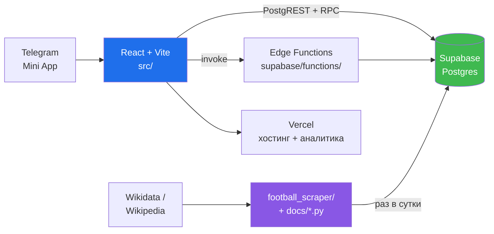
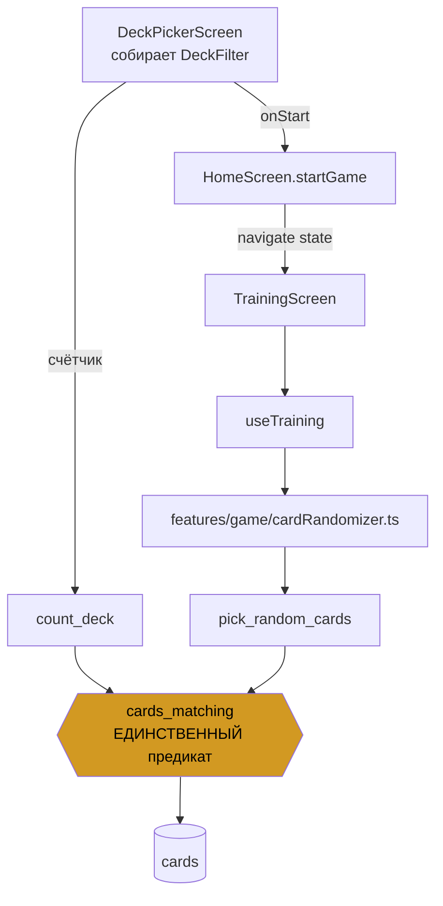
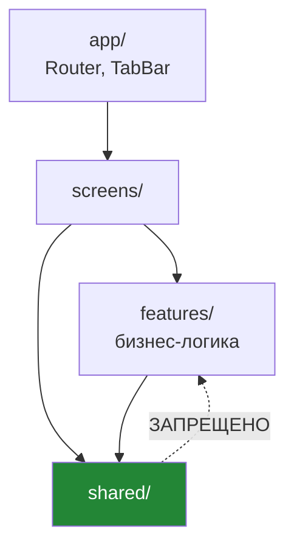
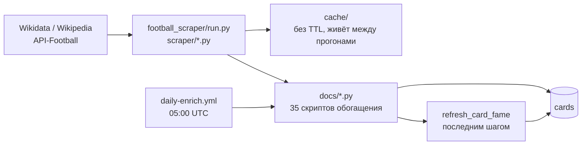

# Карта проекта

Справочник «что где лежит и как связано». `docs/ARCHITECTURE.md` рядом
говорит, **как должно быть** (правила FSD, запреты); этот файл — **как есть
сейчас**.

**Агенту:** прочитай отсюда нужный раздел вместо того, чтобы обходить дерево
grep'ом. Дальше — только те файлы, что названы. Если карта разошлась с кодом,
верен код: почини карту тем же PR.

---

## 1. Система целиком



Своего бэкенда нет. Клиент ходит в Supabase напрямую; всё, что нельзя
доверить клиенту, живёт в RPC с `SECURITY DEFINER` или в Edge Function.

---

## 2. Экраны и роуты

`src/app/Router.tsx` — единственное место, где заводятся роуты.

| Роут | Экран | Что делает |
|---|---|---|
| `/` | `HomeScreen` | лендинг, выбор режима, вход в комнату |
| `/lobby` | `LobbyScreen` | сбор команд, старт игры, вход в голосовой канал |
| `/game` | `GameScreen` | сетевая игра по раундам |
| `/end` | `EndScreen` | итоги, история карточек |
| `/training` | `TrainingScreen` | быстрая игра на одном телефоне |
| `/collection` | `CollectionScreen` → `collection/CardDossier` | коллекция и досье карточки (Pro) |
| `/profile` | `ProfileScreen` → `profile/WeeklyQuests` | уровень, XP, задания недели |
| `/pro` | `ProScreen` | покупка Pro за Telegram Stars |
| `/tutorial` | `TutorialScreen` | обучение |
| `/admin` | `AdminScreen` | кабинет: правка карточек, репорты (по паролю) |

`DeckPickerScreen` и `home/HomeLandingMaster` — не роуты, а части `HomeScreen`.

**Приглашение в комнату — две половины одной фичи.** `features/lobby/invite.ts`
строит ссылку `t.me/<бот>?startapp=<КОД>`, а `HomeScreen` читает её обратно
через `getStartParam()` (`shared/lib/telegram.ts` → `initDataUnsafe.start_param`)
и сразу пробует войти. Одна половина без другой бесполезна: ссылка откроет
приложение, но код не подставится. `start_param` — непроверенный ввод, поэтому
проходит через `normalizeCode()` до любого использования.

Третий путь — QR на ту же ссылку: `shared/lib/qr.ts` (свой кодировщик, без
зависимости в бандле) и `shared/ui/QrCode.tsx`. Правится он только вместе с
`qr.test.ts`, который читает нарисованное настоящим декодером: ошибка в битах
даёт код, который выглядит безупречно и не сканируется.

---

## 3. Путь колоды — главный инвариант

Число под кнопкой и розданные карточки обязаны совпадать. Поэтому фильтр
**один объект**, а предикат **один SQL**:



* Тип фильтра — `src/shared/types/deck.ts` (`DeckFilter`).
* SQL — `supabase/migrations/deck_rpc.sql`.
* `pick_random_cards` и `count_deck` — **единственные** обёртки над
  `cards_matching`. Новый способ выбирать карточки заводить нельзя: он
  разойдётся со счётчиком.
* Предыстория — `docs/FILTERS_REWORK.md`.

⚠️ В `deck_rpc.sql` лежит **легаси-версия `pick_random_cards` на 12
позиционных параметров**. Это временный шим: прод зовёт её позиционно, и её
удаление один раз уже уронило живое приложение. `DROP` выписан в том же
файле — выполнить только после того, как новый фронт раскатан везде.

---

## 4. Слои и зависимости



**`shared/` не импортирует из `features/` и `screens/`** — никогда. Это
правило из `docs/ARCHITECTURE.md`, и его нарушение ломает переиспользование.

| Слой | Путь | Что там |
|---|---|---|
| Состояние | `shared/store/` | `authStore`, `gameStore`, `proStore`, `settingsStore` (Zustand) |
| Типы | `shared/types/` | `database.ts` (зеркало схемы), `deck.ts` (фильтр), `game.ts` |
| Чистая логика | `shared/lib/` | `level`, `quests`, `tier`, `pro`, `photoFit`, `cardName`, `flag`, `sounds`, `telegram`, `useMainButton`, `useKeyboardOpen`, `qr`, `supabase` |
| Компоненты | `shared/ui/` | `Button`, `Chip`, `OptionRow`, `PlayerCard`, `Avatar`, `Timer`, … |
| Фичи | `features/<имя>/` | `use<Фича>.ts` + `<фича>Api.ts` |

Фичи: `auth`, `room`, `lobby`, `game`, `collection`, `pro`, `quests`,
`reports`, `admin`, `voice`.

---

## 5. Фаза игры — только через машину состояний

`features/game/stateMachine.ts` — единственный способ менять фазу. Прямое
присваивание запрещено.

Зовут `transition()`: `features/room/useRoom.ts`,
`features/lobby/useLobby.ts`, `features/game/useGame.ts`.

---

## 6. Серверная поверхность

**RPC** (`supabase/migrations/`):

| Функция | Файл | Назначение |
|---|---|---|
| `cards_matching`, `pick_random_cards`, `count_deck` | `deck_rpc.sql` | колода |
| `fame_tier`, `refresh_card_fame` | `deck_fame.sql` | известность (перцентиль) и производные |
| `increment_player_stats` | `player_progression_xp.sql`, `weekly_quests.sql` | статистика + XP + прогресс заданий, `SECURITY DEFINER` |
| `get_weekly_quests`, `claim_weekly_task`, `weekly_task_codes`, `current_week_start` | `weekly_quests.sql` | задания недели |
| `get_user_status`, `tg_is_pro` | `pro_users.sql`, `pro_onboarding.sql` | Pro и проверка `initData` по HMAC |
| `create_team_room` | `create_team_room.sql` | создание комнаты |
| `end_round` | `end_round_rpc.sql` | захват раунда, подсчёт и запись очков — **одной транзакцией** |
| `award_room_stats`, `on_room_finished` | `award_stats_on_finish.sql` | начисление статистики при переходе комнаты в `finished` |
| `sweep_stale_rooms` | `sweep_stale_rooms.sql` | серверная развёртка брошенных игр, `pg_cron` каждые 5 минут |

⚠️ **`grant_pro` в репозитории нет.** `tg-pay` зовёт её по предполагаемой
сигнатуре `grant_pro(p_secret text, p_telegram_id bigint)`, а определение
живёт только в проде. Меняешь оплату — сначала посмотри функцию в базе, в
файлах её не найдёшь.

**Edge Functions** (`supabase/functions/`):

* `tg-pay` — оплата Telegram Stars; проверяет `initData` на сервере.
* `livekit-token` — токен голосового канала; канал выбирает сервер.

**RLS**: `supabase/migrations/rls_lockdown.sql` — образец для новых таблиц.
Игрок читает свой прогресс, но **не пишет** его; запись — только через
`SECURITY DEFINER`.

---

## 7. Конвейер данных



`fame` — **перцентиль**, поэтому его пересчитывают после последнего шага,
меняющего `pageviews` или `pageviews_i18n`. Иначе шкала съезжает, а вместе с
ней `tier` и тег `legend`.

⚠️ Считается он **не от `cards.pageviews`**: та колонка — только ру-вики.
Метрика — `GREATEST(pageviews_ru, max по 8 языкам из pageviews_i18n)`
(`deck_fame.sql`). Ранговая корреляция ru-only с этой осью — 0.172, то есть
это разные величины; замер в `docs/PLAYER_ATTENTION_ANALYSIS.md`.

⚠️ Кэш скрапера **не имеет TTL и переезжает между прогонами CI**. Один
записанный промах «ничего не найдено» глушил бы запрос вечно — поэтому
промахи не кешируются, а `docs/cache_prune_empty.py` чистит накопленные.
Симптом поломки: «115 карточек обработано, бюджет 0/20000».

---

## 8. Проверки

```bash
npx tsc --noEmit          # noUnusedLocals включён
npm test                  # vitest
npm run test:mutation     # stryker, порог 80 — понижать нельзя
node scripts/check-i18n.mjs
npm run build
cd football_scraper && python3 -m pytest -q          # только hypothesis-тест
cd football_scraper && for f in tests/test_*.py; do python3 "$f"; done

# Серверная логика — руками, базы в CI нет:
psql "$DATABASE_URL" -f supabase/tests/sweep_stale_rooms.test.sql
```

`supabase/tests/*.test.sql` — фикстуры и проверки внутри одной транзакции с
`ROLLBACK`. Гонять **не на проде**: развёртка обходит все комнаты, а тест
вызывает её и с нулевым запасом. Локальная копия или ветка Supabase.

Тесты фронта: `src/**/*.test.ts`, плюс `test/data-integrity/cards.test.ts`
поверх `sherlock_cards.csv`.

Тесты скрапера — **самостоятельные скрипты**, pytest собирает из них только
`test_property_canonical.py`. CI (`ci.yml`) прогоняет и то, и другое.

⚠️ GitHub Actions в этом репозитории **регулярно теряет событие
`pull_request`**. Пуш может остаться вообще без проверок — и это выглядит как
«ещё идут», а не как провал. После пуша смотри чеки PR; если там только
Vercel — запусти `ci.yml` через `workflow_dispatch`.

---

## 9. Что ломается чаще всего

| Грабли | Где написано |
|---|---|
| Строка добавлена не во все 9 локалей | `CLAUDE.md` |
| Формы множественного числа выдуманы для языка, где их нет | `CLAUDE.md` |
| Новый способ выбирать карточки в обход `cards_matching` | §3 |
| Удаление легаси-`pick_random_cards` до раскатки фронта | §3, `deck_rpc.sql` |
| `shared/` импортирует из `features/` | §4 |
| Фаза игры меняется мимо машины состояний | §5 |
| Новая таблица без RLS — игрок пишет себе награды | §6 |
| PR ответвлён от другой ветки `claude/*` → ложные конфликты после squash | `CLAUDE.md` |
| Секрет в переменной с префиксом `VITE_` → попадает в бандл | `supabase/functions/livekit-token/README.md` |
| Миграция молча зависит от другой, применённой руками | `weekly_quests.sql` §0 |
| Начисление статистики «выстрелил и забыл» с клиента | `award_stats_on_finish.sql` |
| Несколько записей подряд с клиента там, где realtime будит остальных после первой | `end_round_rpc.sql` |
| Страховка живёт только на клиенте — а клиентов не осталось | `sweep_stale_rooms.sql` |
| Клавиатура перекрывает кнопку; код комнаты не копируется | `docs/LOBBY_AND_VOICE_FIXES.md` |
| Диплинк `?startapp=` без чтения `start_param` — ссылка открывает приложение, но код никуда не попадает | §2, `features/lobby/invite.ts` |
| `cards.pageviews` принят за «внимание» — а это только ру-вики | §7, `docs/PLAYER_ATTENTION_ANALYSIS.md` |
| `player_seasons` принята за готовую историю — 8577 строк-сирот, `players_meta` пуста | `docs/PLAYER_ATTENTION_ANALYSIS.md` §7 |
